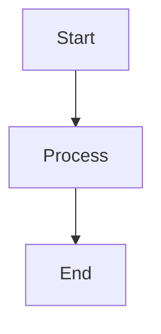
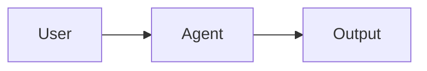

# Documentation

This project uses MkDocs Material for comprehensive technical documentation.

## View Documentation

Online documentation: [https://rcdelacruz.github.io/mcp-sub-agents](https://rcdelacruz.github.io/mcp-sub-agents)

## Local Development

### Prerequisites

Install MkDocs and MkDocs Material:

```bash
pip install mkdocs mkdocs-material
```

### Serve Locally

Run the documentation server for local development:

```bash
mkdocs serve
```

Then open [http://localhost:8000](http://localhost:8000) in your browser.

The server automatically reloads when you edit documentation files.

### Build Static Site

Generate the static documentation site:

```bash
mkdocs build
```

Output will be in the `site/` directory.

## Documentation Structure

```
docs/
├── index.md                        # Home page
├── getting-started/
│   ├── installation.md             # Installation guide
│   └── quick-start.md              # Quick start guide
├── architecture/
│   ├── overview.md                 # Two-tier architecture
│   └── workflow-commands.md        # Workflow command reference
├── agents/
│   ├── savants.md                  # Savant agents
│   ├── javascript-specialists.md   # JavaScript specialists
│   └── cross-cutting-specialists.md # Cross-cutting specialists
├── guides/
│   ├── workflows.md                # Real-world workflows
│   └── best-practices.md           # Best practices
├── reference/
│   └── tech-stack.md               # Technology stack reference
├── contributing.md                 # Contributing guide
├── faq.md                          # FAQ
├── stylesheets/
│   └── extra.css                   # Custom CSS
└── javascripts/
    └── mermaid-init.js             # Mermaid initialization
```

## Features

### MkDocs Material Theme

- Professional dark/light theme
- Three-pane layout (navigation, content, TOC)
- Mobile-responsive design
- Search functionality
- Code syntax highlighting
- Copy code button

### Mermaid Diagrams

Architecture and flow diagrams using Mermaid:

```markdown

```

### Admonitions

Important information callouts:

```markdown
!!! note "Configuration Required"
    Make sure to set the environment variable.

!!! warning "Breaking Change"
    Version 2.0 introduces breaking changes.

!!! tip "Performance Tip"
    Enable caching for better performance.
```

### Code Examples

Syntax-highlighted code with copy button:

```markdown
```typescript
const example = 'value'
```
```

### Custom Styling

- Work Sans font for readability
- JetBrains Mono for code
- Professional color scheme
- Accessibility-first design
- No motion animations (accessibility)

## Deployment

This documentation site can be deployed to multiple platforms:

### Cloudflare Pages (Recommended)

Fast global CDN with unlimited bandwidth on the free tier.

**Automated deployment via GitHub Actions:**

1. Set up Cloudflare API token and Account ID
2. Add secrets to GitHub repository:
   - `CLOUDFLARE_API_TOKEN`
   - `CLOUDFLARE_ACCOUNT_ID`
3. Push to `main` branch
4. GitHub Actions automatically deploys to Cloudflare Pages
5. Available at `https://mcp-sub-agents-docs.pages.dev`

**Manual deployment with Wrangler CLI:**

```bash
# Install Wrangler
npm install -g wrangler

# Login to Cloudflare
wrangler login

# Build and deploy
mkdocs build
wrangler pages deploy site --project-name=mcp-sub-agents-docs
```

**Features:**
- 300+ global edge locations
- Unlimited bandwidth and requests
- Automatic preview deployments for PRs
- Custom domain support with automatic SSL
- Built-in analytics
- Fast builds with caching

See [CLOUDFLARE-DEPLOYMENT.md](CLOUDFLARE-DEPLOYMENT.md) for complete setup guide.

### GitHub Pages

Traditional GitHub-hosted deployment.

**Automated deployment via GitHub Actions:**

1. Push changes to `main` branch
2. GitHub Actions runs `mkdocs gh-deploy`
3. Site published to GitHub Pages
4. Available at https://rcdelacruz.github.io/mcp-sub-agents

**Manual deployment:**

```bash
mkdocs gh-deploy
```

This builds the site and pushes to the `gh-pages` branch.

### Comparison

| Feature | Cloudflare Pages | GitHub Pages |
|---------|------------------|--------------|
| Speed | 300+ edge locations | GitHub CDN |
| Bandwidth | Unlimited | 100GB/month |
| Custom domains | Unlimited | 1 per repo |
| Preview deploys | Yes | No |
| Analytics | Built-in | External only |

## Writing Documentation

### Markdown Format

Use standard Markdown with MkDocs extensions:

```markdown
# Page Title

## Section Heading

### Subsection

Regular text with **bold** and *italic*.

- Bullet list
- Item 2

1. Numbered list
2. Item 2

[Link text](https://example.com)

```code block```
```

### Code Blocks

Always specify language for syntax highlighting:

```markdown
```typescript
const example: string = 'value'
```

```bash
npm install package-name
```
```

### Diagrams

Use Mermaid for architecture diagrams:

```markdown

```

### Cross-References

Link to other documentation pages:

```markdown
See [Installation Guide](getting-started/installation.md)
```

### Admonitions

Use for important information:

```markdown
!!! note
    This is a note.

!!! warning
    This is a warning.

!!! tip
    This is a tip.

!!! danger
    This is dangerous information.
```

## Contributing to Documentation

### Guidelines

- Use clear, concise language
- Include practical examples
- Add diagrams where helpful
- Cross-reference related pages
- Keep formatting consistent
- Ensure mobile responsiveness

### No Emojis

Documentation should be professional without emojis.

### Accessibility

- Use semantic headings (H1 → H2 → H3)
- Provide alt text for images
- Ensure good color contrast
- Support keyboard navigation
- Add ARIA labels where needed

## Testing

Before committing documentation changes:

1. **Build locally:**
   ```bash
   mkdocs build
   ```

2. **Serve and review:**
   ```bash
   mkdocs serve
   ```

3. **Check for errors:**
   - Broken links
   - Missing images
   - Formatting issues
   - Code example errors

4. **Test on mobile:**
   - Responsive design
   - Navigation works
   - Readable text

## Troubleshooting

### Port Already in Use

If port 8000 is in use:

```bash
mkdocs serve -a localhost:8001
```

### Mermaid Diagrams Not Rendering

Check JavaScript console for errors. Ensure:

- Mermaid CDN is accessible
- mermaid-init.js is loaded
- Diagram syntax is valid

### Theme Not Working

Reinstall MkDocs Material:

```bash
pip install --upgrade mkdocs-material
```

## Additional Resources

- [MkDocs Documentation](https://www.mkdocs.org/)
- [MkDocs Material Documentation](https://squidfunk.github.io/mkdocs-material/)
- [Mermaid Documentation](https://mermaid.js.org/)
- [Markdown Guide](https://www.markdownguide.org/)
