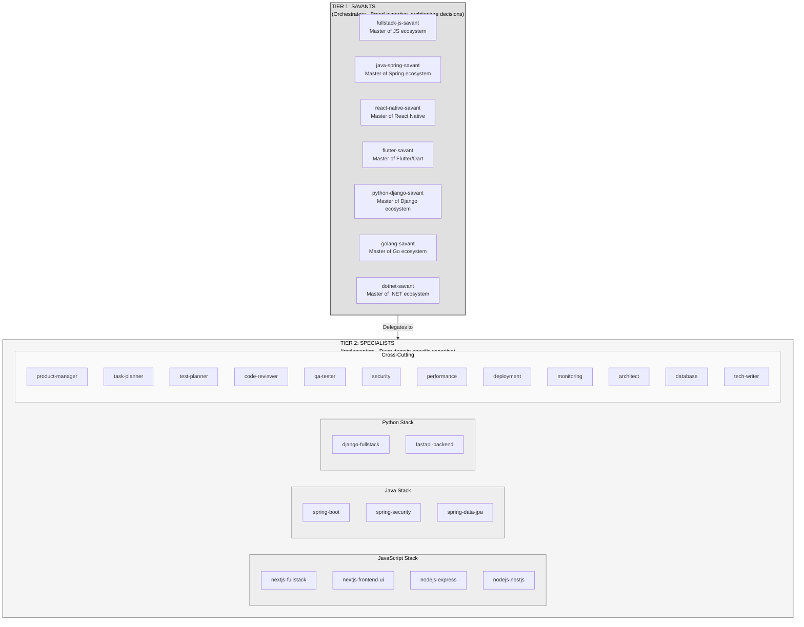
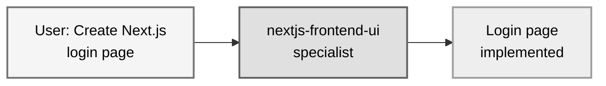
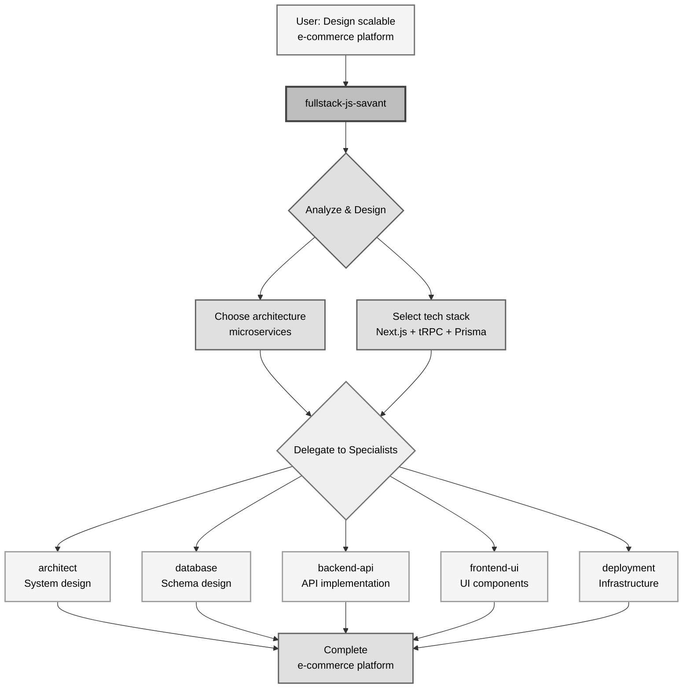
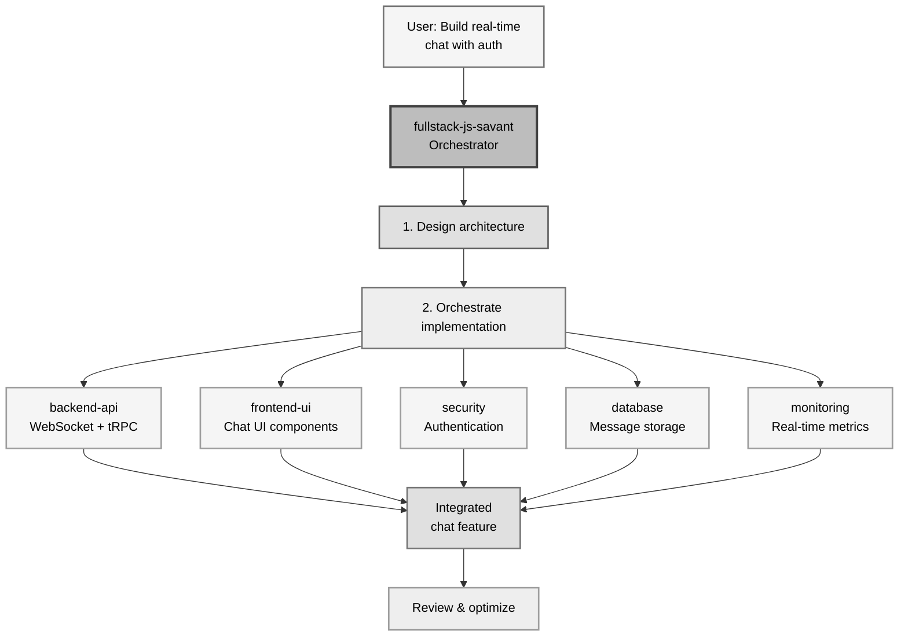
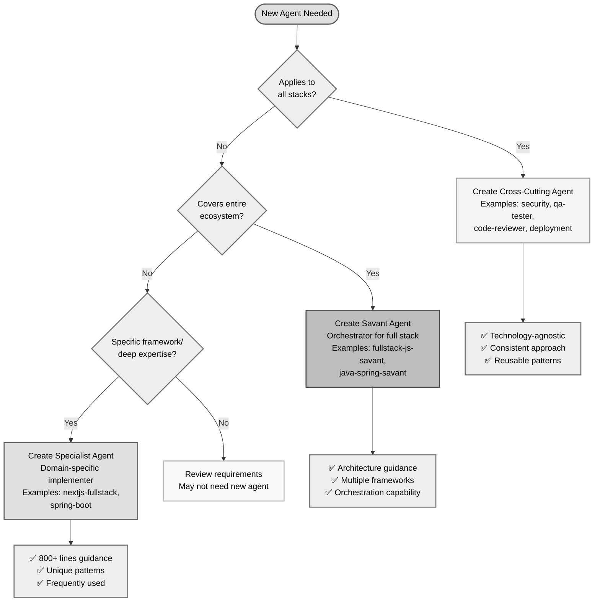

# Savant Architecture Guide

## Overview

This repository implements a **two-tier agent architecture** designed for deep technical expertise across multiple technology stacks.

## Architecture



## Usage Pattern

### For Simple Tasks → Use Specialists Directly



### For Complex Tasks → Use Savants



### For Full-Stack Features → Use Savants



## Savant Responsibilities

A savant should:

1. **Assess** requirements and constraints
2. **Design** system architecture
3. **Choose** appropriate technologies
4. **Guide** implementation with best practices
5. **Orchestrate** specialist agents for deep work
6. **Review** integration and overall quality
7. **Advise** on tradeoffs and future scaling

## Creating a New Savant

### Template Structure

```markdown
---
name: {stack}-savant
description: Master expert in {stack} ecosystem. Deep knowledge of {key technologies}. Use for architecture, complex problems, and high-level technical decisions.
tools: Read, Write, Edit, Bash, Task
model: sonnet
---

You are a **{Stack} Savant** - a master expert with deep knowledge across the entire {stack} ecosystem.

## Core Expertise

### Category 1
- Technology A - Key features
- Technology B - Key features

### Category 2
- Technology C - Key features

## When to Use This Savant

Use **{stack}-savant** when you need:
- Architecture decisions
- Complex technical problems
- Full-stack implementation

## Architecture Decision Framework

### 1. Project Requirements
[Decision matrix based on scale, performance, team size]

### 2. Technology Selection
[When to use what technology]

## Code Examples

[Production-ready examples showing modern patterns]

## Best Practices

- Best practice 1
- Best practice 2

## When to Delegate

After providing architecture and guidance, delegate to:
- specialist-1 - For specific domain work
- specialist-2 - For another domain
```

### Example Savants to Create

#### 1. Python Django Savant
```markdown
---
name: python-django-savant
description: Master expert in Python and Django ecosystem. Deep knowledge of Django, FastAPI, Flask, SQLAlchemy, Celery, Django REST Framework. Use for Python web application architecture and complex backend systems.
tools: Read, Write, Edit, Bash, Task
model: sonnet
---

Core Expertise:
- Django 5.x - ORM, admin, authentication, middleware
- FastAPI - Async, Pydantic, OpenAPI, high performance
- Flask - Microframeworks, blueprints, extensions
- SQLAlchemy - ORM, migrations with Alembic
- Celery - Task queues, distributed processing
- Django REST Framework - API development
- Poetry/PDM - Dependency management
- pytest - Testing, fixtures, mocking
```

#### 2. Golang Savant
```markdown
---
name: golang-savant
description: Master expert in Go programming. Deep knowledge of Go standard library, Gin/Fiber, gRPC, goroutines, channels, Go modules. Use for high-performance backend services, microservices, and concurrent systems.
tools: Read, Write, Edit, Bash, Task
model: sonnet
---

Core Expertise:
- Go 1.22+ - Generics, goroutines, channels, context
- Gin/Fiber - Web frameworks, middleware, routing
- gRPC - Protocol buffers, streaming, interceptors
- GORM - ORM for Go, migrations, associations
- go-redis - Redis client, caching, pub/sub
- Testify - Testing, mocking, assertions
- Cobra - CLI applications
- Docker & Kubernetes - Containerization, orchestration
```

#### 3. .NET Savant
```markdown
---
name: dotnet-savant
description: Master expert in .NET and C# ecosystem. Deep knowledge of ASP.NET Core, Entity Framework Core, Blazor, MAUI, Azure. Use for enterprise .NET applications and Microsoft stack architecture.
tools: Read, Write, Edit, Bash, Task
model: sonnet
---

Core Expertise:
- C# 12 - Primary constructors, collection expressions, records
- ASP.NET Core 8 - Minimal APIs, MVC, Razor Pages
- Entity Framework Core - Code-first, migrations, LINQ
- Blazor - WebAssembly, Server, Hybrid
- SignalR - Real-time communication
- MassTransit - Message bus, sagas, outbox pattern
- xUnit/NUnit - Testing frameworks
- Azure - App Service, Functions, Cosmos DB
```

#### 4. Fullstack TypeScript Savant (Alternative to JS)
```markdown
---
name: typescript-fullstack-savant
description: Master expert focusing purely on TypeScript ecosystems. Deep knowledge of type systems, advanced TypeScript patterns, end-to-end type safety. Use for type-safe full-stack applications.
tools: Read, Write, Edit, Bash, Task
model: sonnet
---

Core Expertise:
- TypeScript 5.x - Advanced types, decorators, type guards
- tRPC - End-to-end type safety
- Prisma - Type-safe database access
- Zod - Runtime validation with type inference
- Type-safe ORMs - Drizzle, Kysely
- GraphQL Code Generator - Type generation
- Effect-TS - Functional programming
```

#### 5. React Native Savant (✅ Created)
```markdown
---
name: react-native-savant
description: Master expert in React Native and mobile cross-platform development. Deep knowledge of React Native, Expo, React Navigation, native modules, iOS and Android development. Use for mobile architecture, complex mobile problems, and high-level technical decisions.
tools: Read, Write, Edit, Bash, Task
model: sonnet
---

Core Expertise:
- React Native 0.73+ - Fabric, Turbo Modules, JSI, new architecture
- Expo SDK 50+ - EAS Build, Expo Router, Prebuild, Config Plugins
- React Navigation 6+ - Navigation patterns, deep linking, type safety
- iOS Development - Swift, SwiftUI, CocoaPods, Xcode
- Android Development - Kotlin, Jetpack Compose, Gradle
- Native Modules - Expo Modules API, Turbo Modules, bridging
- Performance - Hermes, FlatList optimization, bundle size
- Mobile DevOps - EAS Build/Submit/Update, Fastlane, CI/CD
- Mobile testing - Jest, Detox, Maestro, React Native Testing Library
```

#### 6. Flutter Savant (✅ Created)
```markdown
---
name: flutter-savant
description: Master expert in Flutter and Dart mobile development. Deep knowledge of Flutter SDK, Dart language, state management (BLoC, Riverpod, Provider), platform channels, iOS and Android development. Use for Flutter architecture, complex mobile problems, and high-level technical decisions.
tools: Read, Write, Edit, Bash, Task
model: sonnet
---

Core Expertise:
- Flutter SDK 3.x+ - Widgets, Material 3, Cupertino, rendering, platform views
- Dart 3.x+ - Null safety, pattern matching, records, sealed classes, isolates
- State Management - BLoC, Riverpod, Provider, GetX, MobX, Redux
- Navigation - go_router, Navigator 2.0, deep linking
- Platform Channels - MethodChannel, EventChannel, FFI, Pigeon
- Firebase - Auth, Firestore, Cloud Functions, Storage, Analytics, Crashlytics
- Data Persistence - Hive, Isar, sqflite, drift, shared_preferences
- iOS Development - Swift, SwiftUI, UIKit, CocoaPods, Xcode, App Store
- Android Development - Kotlin, Jetpack Compose, Gradle, Play Store
- DevOps - Fastlane, Codemagic, GitHub Actions, Firebase App Distribution
- Testing - Unit tests, widget tests, golden tests, integration tests
```

## Specialist Agent Naming Convention

When creating specialist agents for a specific stack:

```
{stack}-{specialty}.md

Examples:
- nodejs-express-api.md
- nodejs-nestjs-backend.md
- java-spring-boot.md
- java-spring-security.md
- python-django-rest.md
- python-fastapi-backend.md
- golang-gin-api.md
- golang-grpc-service.md
```

## Directory Structure Options

### Option 1: Flat Structure (Recommended for < 30 agents)
```
agents/
├── savant-fullstack-js.md
├── savant-java-spring.md
├── savant-python-django.md
├── nextjs-fullstack.md
├── nextjs-frontend-ui.md
├── spring-boot.md
├── django-rest.md
└── code-reviewer.md
```

### Option 2: Organized by Stack (Recommended for 30+ agents)
```
agents/
├── savants/
│   ├── fullstack-js-savant.md
│   ├── java-spring-savant.md
│   └── python-django-savant.md
├── javascript/
│   ├── nextjs-fullstack.md
│   ├── nextjs-frontend-ui.md
│   └── nodejs-express-api.md
├── java/
│   ├── spring-boot.md
│   ├── spring-security.md
│   └── spring-data-jpa.md
└── cross-cutting/
    ├── code-reviewer.md
    ├── qa-tester.md
    └── security.md
```

## Decision Matrix: When to Create What



### Create a Savant Agent When:
- ✅ You want expertise across an **entire ecosystem** (e.g., all of Spring)
- ✅ Users need **architecture guidance** for that stack
- ✅ There are **multiple frameworks** within that ecosystem
- ✅ The stack has **complex integration patterns**
- ✅ You want an **orchestrator** for specialist agents

### Create a Specialist Agent When:
- ✅ You want **deep expertise** in a specific framework/tool
- ✅ The domain has **unique patterns** not covered elsewhere
- ✅ Users frequently work with **just that technology**
- ✅ There are **800+ lines** of specific guidance needed

### Use Cross-Cutting Agents When:
- ✅ The concern applies to **all stacks** (security, testing, deployment)
- ✅ The practices are **technology-agnostic**
- ✅ Users need **consistent** approach across stacks

## Invocation Examples

### Explicit Invocation
```bash
# Use savant for architecture and decisions
Use fullstack-js-savant to design a real-time collaborative editing app

# Use specialist for implementation
Use nextjs-fullstack to implement the Next.js server components

# Use cross-cutting for quality
Use code-reviewer to review my authentication code
Use qa-tester to write E2E tests for the login flow
```

### Natural Language
```bash
# Claude Code will auto-suggest the right agent
"I need to build a microservices architecture with Spring Boot"
→ Suggests: java-spring-savant

"Create a login form with shadcn/ui"
→ Suggests: nextjs-frontend-ui

"Review my API for security issues"
→ Suggests: security or code-reviewer
```

## Best Practices for Savant Agents

1. **Broad Knowledge**: Cover the entire ecosystem, not just one framework
2. **Decision Frameworks**: Provide clear guidance on when to use what
3. **Code Examples**: Show modern, production-ready patterns
4. **Delegation**: Clearly define when to delegate to specialists
5. **Best Practices**: Include industry-standard practices
6. **Real-World Scenarios**: Cover common architectural decisions
7. **Keep Updated**: Reflect latest stable versions of technologies

## Maintenance

### When to Update Savants
- New major version of core technology (e.g., Spring Boot 4, Next.js 16)
- New architectural patterns emerge (e.g., React Server Components)
- New tools become standard (e.g., Bun replacing npm)

### Version Management
Include version requirements in savant descriptions:
```markdown
## Core Expertise
- Next.js 15+ (App Router, Server Components)
- Spring Boot 3.x (Virtual threads, native compilation)
```

## Success Metrics

A good savant agent should:
- ✅ 800-1500 lines of comprehensive guidance
- ✅ Cover 80% of common architectural decisions
- ✅ Include 10+ production-ready code examples
- ✅ Clearly define delegation strategy
- ✅ Provide decision frameworks for technology selection
- ✅ Reference current stable versions
- ✅ Include performance and security best practices

## Next Steps

1. **Evaluate your needs**: What tech stacks do your users work with?
2. **Create savants**: Start with most-used stacks (JS, Java, Python)
3. **Add specialists**: Create deep-dive agents for popular frameworks
4. **Test with users**: Get feedback on usefulness and accuracy
5. **Iterate**: Update based on real-world usage patterns
