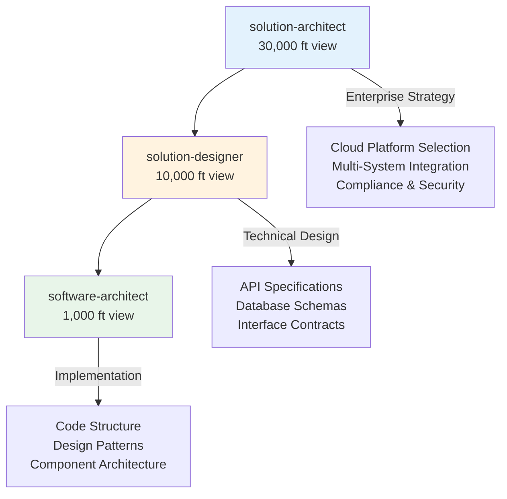
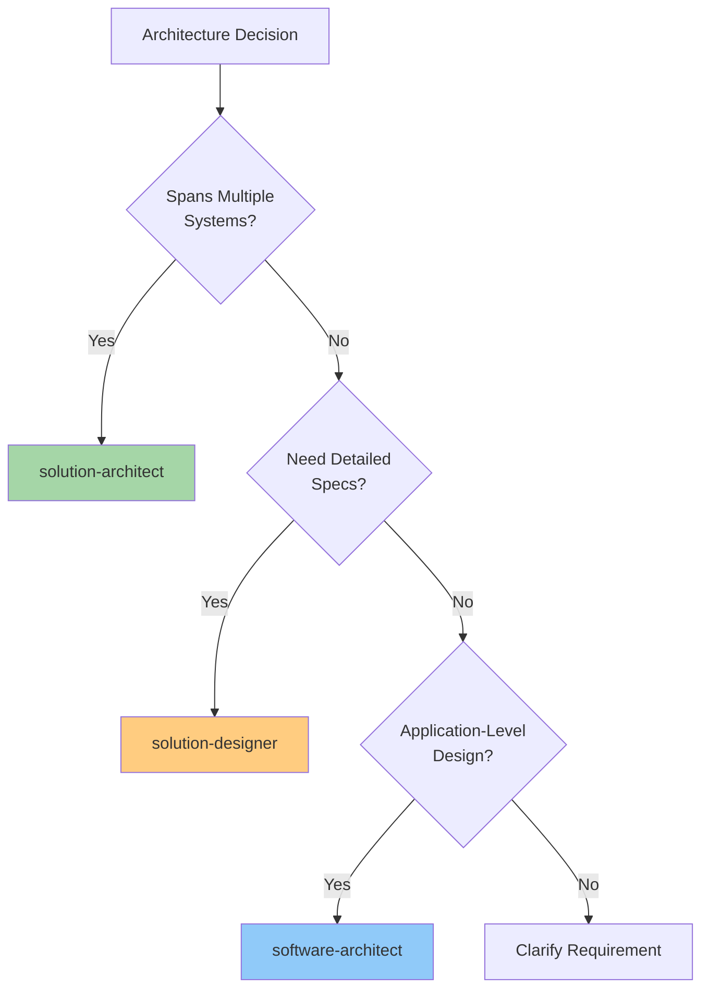
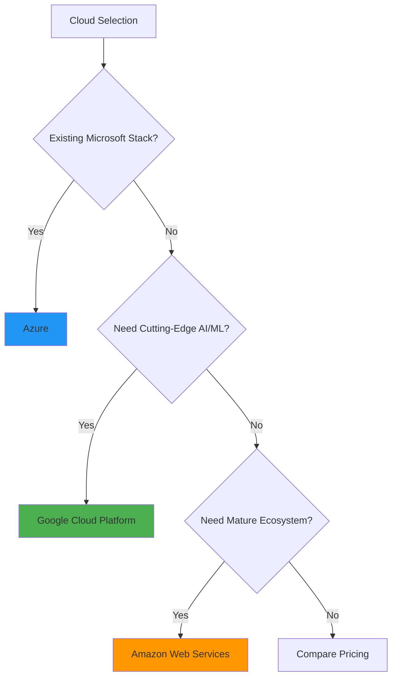
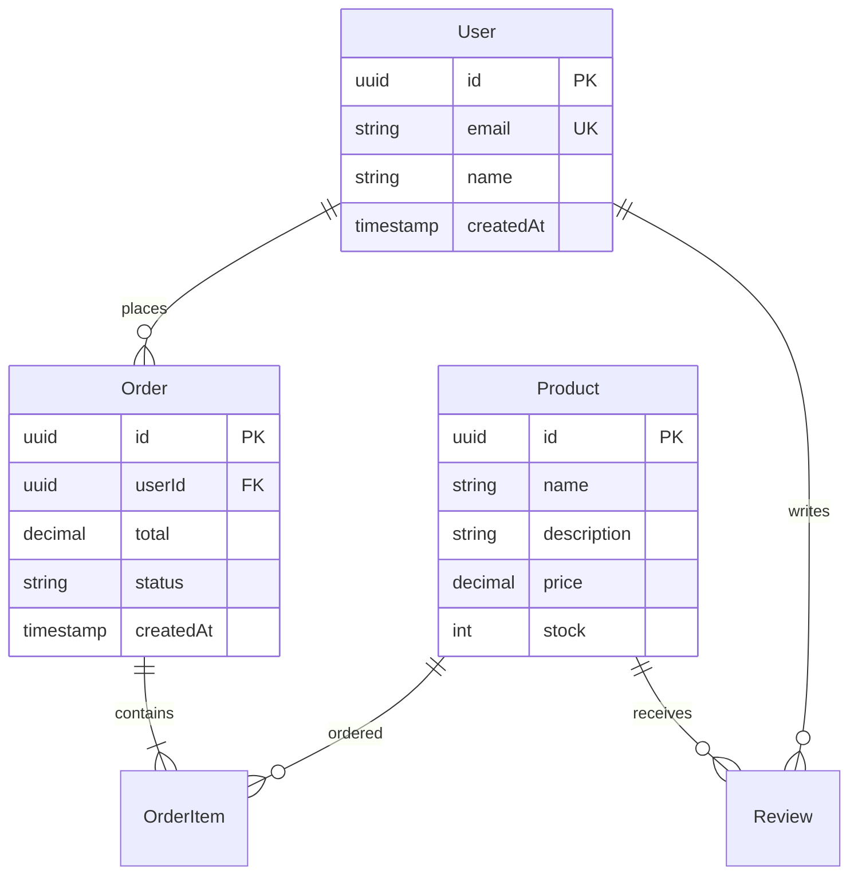
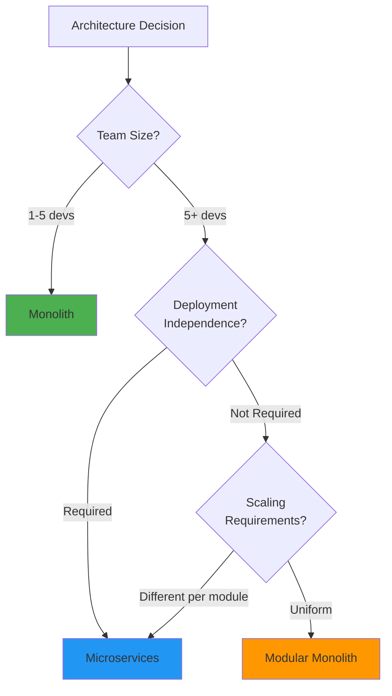
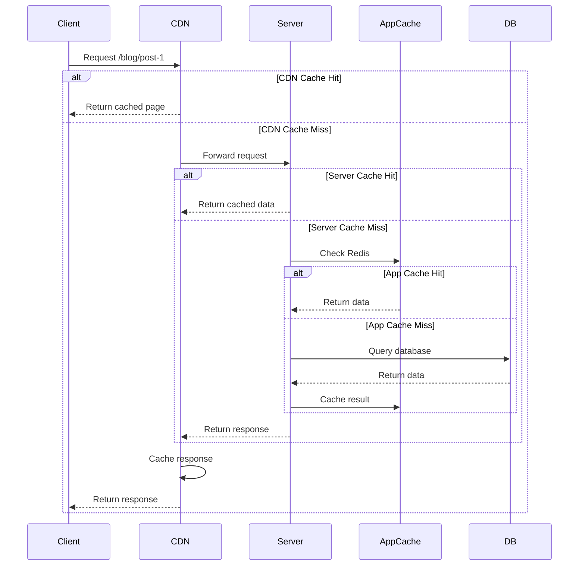
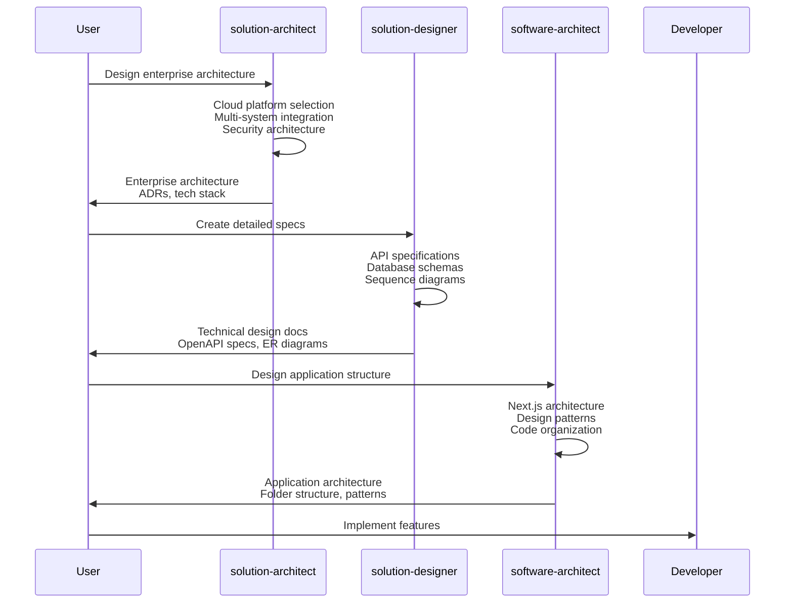
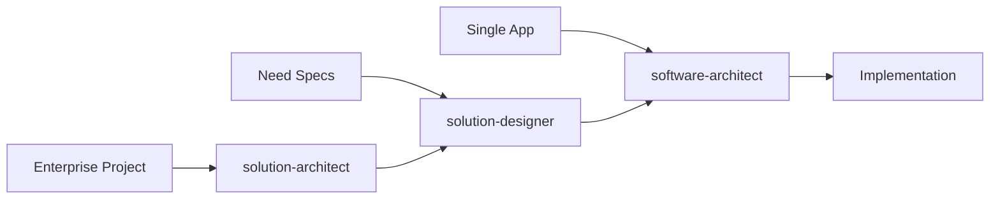

# Architecture Agents

Architecture agents are specialized experts that handle design decisions at different levels of abstraction. The three-tier system separates enterprise-level, detailed design, and application-level concerns to provide focused, expert guidance at each layer.

## Overview

The architecture agent system consists of three specialized agents:

- **solution-architect** - Enterprise-level, multi-system architecture and cloud platform selection
- **solution-designer** - Detailed technical design, API specifications, and database schemas
- **software-architect** - Application-level architecture, design patterns, and code structure

## The Three-Tier Architecture Model



## When to Use Which Agent



---

## solution-architect

**Name:** `solution-architect`

**Description:** Expert in enterprise-level architecture, multi-system integration, cloud platform selection, technology stack decisions, and cross-cutting concerns that span multiple applications or external systems.

### Expertise Areas

- **Enterprise Architecture** - Business, data, application, and technology architecture
- **Multi-System Integration** - API gateways, event-driven architecture, service mesh
- **Cloud Platform Selection** - AWS, Azure, GCP evaluation and recommendations
- **Technology Stack Decisions** - Backend frameworks, databases, messaging systems
- **Security Architecture** - Zero-trust, multi-tenant patterns, compliance (GDPR, HIPAA, SOC2)
- **Scalability Strategy** - Horizontal/vertical scaling, auto-scaling, multi-region deployment
- **Infrastructure Architecture** - Network design, load balancing, CDN configuration
- **Compliance & Governance** - Regulatory requirements, Architecture Decision Records (ADRs)

### Key Decisions Handled

#### Cloud Platform Selection



#### Integration Patterns

- **API Gateway** - Unified entry point for microservices (Kong, AWS API Gateway, Azure API Management)
- **Event-Driven** - Asynchronous communication (Kafka, RabbitMQ, AWS SNS/SQS, Azure Service Bus)
- **Service Mesh** - Service-to-service communication (Istio, Linkerd, Consul Connect)

### When to Use

- Selecting cloud platform (AWS vs Azure vs GCP)
- Designing multi-system integration architecture
- Making enterprise-wide technology stack decisions
- Planning scalability across multiple systems
- Implementing zero-trust security architecture
- Achieving compliance requirements (GDPR, HIPAA, SOC2, PCI DSS)
- Designing for multi-region deployment
- System-of-systems architecture
- Event-driven architecture across platforms

### Defer To

- **solution-designer** - For detailed API specifications, database schemas, component diagrams
- **software-architect** - For application-level code structure, design patterns within a single app

### Usage Examples

**Example 1: Cloud Platform Selection**
```bash
Use solution-architect to evaluate AWS, Azure, and GCP for our e-commerce platform.

Requirements:
- High traffic (1M+ daily users)
- Real-time inventory management
- Multi-region deployment (US, EU, APAC)
- PCI DSS compliance required
- Team familiar with .NET and Azure DevOps
```

**Example 2: Multi-System Integration**
```bash
Use solution-architect to design an integration architecture connecting:
- Salesforce (CRM)
- SAP (ERP)
- Custom inventory management system
- E-commerce platform (Shopify)
- Analytics platform (Snowflake)
```

**Example 3: Enterprise Security Architecture**
```bash
Use solution-architect to design a zero-trust security architecture for our SaaS platform.

Requirements:
- Multi-tenant architecture
- SSO across all applications
- SOC 2 Type II compliance
- Support for enterprise customers (SAML, AD integration)
```

### Deliverables

When using solution-architect, expect:

1. **Architecture Decision Records (ADRs)** - Documented decisions with context, alternatives, and consequences
2. **Technology Selection Matrix** - Evaluation criteria, scoring, and recommendations
3. **System Context Diagrams** - High-level view of systems and interactions (Mermaid)
4. **Integration Strategy** - API contracts, event schemas, data flow diagrams
5. **Security Architecture** - Authentication/authorization model, network security, compliance mapping
6. **Scalability Plan** - Current vs target capacity, scaling triggers, cost projections

---

## solution-designer

**Name:** `solution-designer`

**Description:** Expert in detailed technical design, API specifications, database schemas, interface contracts, and sequence diagrams. Bridges architecture and implementation by creating comprehensive technical specifications.

### Expertise Areas

- **API Specification** - OpenAPI 3.0, GraphQL schemas, tRPC contracts
- **Database Schema Design** - Relational modeling, normalization, indexing strategy
- **Prisma Schema** - Complete Prisma models with relations, enums, and constraints
- **Sequence Diagrams** - Detailed workflow and interaction diagrams
- **Component Diagrams** - Frontend/backend interaction, module boundaries
- **Data Flow Diagrams** - End-to-end data movement and transformation
- **Interface Contracts** - TypeScript interfaces for service-to-service communication
- **Technical Design Documents** - Comprehensive TDDs with all technical details

### Key Deliverables

#### API Specifications

Complete OpenAPI 3.0 specifications including:

- All endpoints with HTTP methods
- Request/response schemas
- Authentication requirements
- Error responses
- Rate limiting
- Examples and descriptions

#### Database Schemas



#### Sequence Diagrams

Detailed workflow diagrams showing:

- User interactions
- Service calls
- Database operations
- External API calls
- Error handling paths

### When to Use

- Creating OpenAPI specifications for REST APIs
- Designing database schemas with proper normalization
- Writing Prisma schemas with all relations and constraints
- Creating detailed sequence diagrams for complex workflows
- Designing service-to-service interface contracts
- Documenting data flow across systems
- Creating comprehensive Technical Design Documents (TDDs)
- Specifying component interactions

### Defer To

- **solution-architect** - For enterprise-level decisions, cloud platform selection, multi-system strategy
- **software-architect** - For code organization, design pattern selection, application structure

### Usage Examples

**Example 1: API Specification**
```bash
Use solution-designer to create a complete OpenAPI 3.0 specification for our User Management API.

Features:
- User registration and authentication
- Profile management
- Password reset
- Email verification
- Role-based access control
```

**Example 2: Database Schema Design**
```bash
Use solution-designer to design a normalized database schema for an e-commerce platform.

Requirements:
- Users, products, orders, reviews
- Support for product variants (size, color)
- Order history with status tracking
- Multiple shipping addresses per user
- Inventory management
```

**Example 3: Technical Design Document**
```bash
Use solution-designer to create a comprehensive TDD for our payment processing integration.

Include:
- Sequence diagrams for checkout flow
- API specifications for payment endpoints
- Database schema for transactions
- Error handling strategies
- Security considerations
```

### Deliverables

When using solution-designer, expect:

1. **OpenAPI 3.0 Specifications** - Complete API documentation
2. **Prisma Schemas** - Full database models with relations
3. **ER Diagrams** - Entity-relationship diagrams (Mermaid)
4. **Sequence Diagrams** - Detailed interaction flows (Mermaid)
5. **Component Diagrams** - System component relationships (Mermaid)
6. **Technical Design Documents** - Comprehensive specifications
7. **Interface Contracts** - TypeScript types for all services

---

## software-architect

**Name:** `software-architect`

**Description:** Expert in application-level architecture, design patterns, code structure, and scalability within a single application or bounded context. Focuses on Next.js app structure, component design, caching strategies, and code organization.

### Expertise Areas

- **Next.js Architecture** - App Router structure, Server/Client Components, layout organization
- **Design Patterns** - Repository, Service, Factory, Strategy, Observer patterns
- **Code Organization** - Feature-based vs layer-based architecture, module boundaries
- **Monolith vs Microservices** - When to use each pattern
- **Caching Strategies** - Multi-layer caching (CDN, server, database, application)
- **API Design** - REST, tRPC, GraphQL selection and implementation
- **Database Patterns** - Repository pattern, N+1 prevention, connection pooling
- **Resilience Patterns** - Circuit breaker, retry logic, graceful degradation
- **Event-Driven Architecture** - Event sourcing, CQRS within an application

### Key Decisions Handled

#### Monolith vs Microservices



#### Caching Strategy



### When to Use

- Designing Next.js application structure
- Choosing between App Router patterns (Server vs Client Components)
- Implementing design patterns (Repository, Service, Factory)
- Planning application-level caching strategies
- Organizing code structure (feature-based vs layer-based)
- Making monolith vs microservices decisions
- Designing REST, tRPC, or GraphQL APIs
- Implementing resilience patterns (circuit breaker, retry)
- Preventing N+1 database queries
- Future-proofing application architecture

### Defer To

- **solution-architect** - For enterprise-level decisions, multi-system integration, cloud platform selection
- **solution-designer** - For detailed API specs, database schemas, sequence diagrams

### Usage Examples

**Example 1: Next.js App Structure**
```bash
Use software-architect to design the folder structure for a Next.js 15 SaaS application.

Features:
- Multi-tenant (organization-based)
- Admin dashboard
- Public marketing site
- User dashboard
- API routes with tRPC
- Shared component library
```

**Example 2: Caching Strategy**
```bash
Use software-architect to design a comprehensive caching strategy for our e-commerce platform.

Requirements:
- Product catalog (10,000+ products)
- Real-time inventory
- User sessions
- Shopping cart
- Frequently accessed data
```

**Example 3: Design Pattern Selection**
```bash
Use software-architect to recommend design patterns for our data access layer.

Context:
- Next.js with Prisma
- Multiple database operations per request
- Need for transaction support
- Want to avoid N+1 queries
- Future: May switch from PostgreSQL to MongoDB
```

### Deliverables

When using software-architect, expect:

1. **Folder Structure Diagrams** - Complete directory organization (Mermaid)
2. **Design Pattern Examples** - Code examples with TypeScript
3. **Architecture Decision Rationale** - Why monolith vs microservices, etc.
4. **Caching Strategy Diagrams** - Multi-layer caching flows (Mermaid)
5. **API Design Recommendations** - REST vs tRPC vs GraphQL with rationale
6. **Database Access Patterns** - Repository pattern, N+1 prevention
7. **Resilience Patterns** - Circuit breaker, retry logic examples

---

## Agent Coordination

The three architecture agents work together in a coordinated flow:



## Decision Matrix

Use this matrix to determine which agent to use:

| Question | solution-architect | solution-designer | software-architect |
|----------|-------------------|-------------------|-------------------|
| Spans multiple systems? | ✅ | ❌ | ❌ |
| Need cloud platform selection? | ✅ | ❌ | ❌ |
| Enterprise compliance required? | ✅ | ❌ | ❌ |
| Need detailed API specs? | ❌ | ✅ | ❌ |
| Need database schema design? | ❌ | ✅ | ❌ |
| Need sequence diagrams? | ❌ | ✅ | ❌ |
| Single application design? | ❌ | ❌ | ✅ |
| Need design patterns? | ❌ | ❌ | ✅ |
| Code organization? | ❌ | ❌ | ✅ |
| Caching strategy? | ❌ | ❌ | ✅ |

## Best Practices

### 1. Start at the Right Level



### 2. Use in Sequence for Complex Projects

For large projects, use all three agents in sequence:

1. **solution-architect** - Establish enterprise strategy, cloud platform, integration patterns
2. **solution-designer** - Create detailed specifications, API contracts, database schemas
3. **software-architect** - Design application structure, select design patterns, organize code

### 3. Leverage Handoffs

Each agent explicitly states when to defer to another:

- **solution-architect** defers detailed specs to **solution-designer**
- **solution-designer** defers code organization to **software-architect**
- **software-architect** defers multi-system integration to **solution-architect**

### 4. Document All Decisions

All architecture agents emphasize documentation:

- **solution-architect** creates Architecture Decision Records (ADRs)
- **solution-designer** creates Technical Design Documents (TDDs)
- **software-architect** documents design patterns and rationale

## Common Scenarios

### Scenario 1: New Enterprise Application

**User Goal:** Build a new multi-tenant SaaS platform

**Agent Flow:**

1. **solution-architect** - Choose cloud platform (AWS), design multi-tenant architecture, plan scalability
2. **solution-designer** - Create API specifications, design database schema with tenant isolation
3. **software-architect** - Design Next.js app structure, implement Repository pattern, plan caching

### Scenario 2: Microservices Migration

**User Goal:** Split monolith into microservices

**Agent Flow:**

1. **solution-architect** - Design service boundaries, choose service mesh, plan event-driven communication
2. **solution-designer** - Define service interface contracts, design inter-service APIs
3. **software-architect** - Refactor monolith modules, implement anti-corruption layers

### Scenario 3: Single Application

**User Goal:** Build a simple blog platform

**Agent Flow:**

1. **software-architect** - Design Next.js app structure, choose design patterns, plan caching
2. **solution-designer** - Create API specs for blog endpoints, design database schema
3. Implementation - No need for solution-architect (single system)

## Summary

Architecture agents provide:

- **Separation of Concerns** - Enterprise, design, and application levels
- **Expert Guidance** - Focused expertise at each abstraction level
- **Clear Handoffs** - Explicit deferral between agents
- **Comprehensive Coverage** - From cloud selection to code organization
- **Documentation** - ADRs, TDDs, diagrams at every level

## Next Steps

- [View savant agents](savants.md)
- [View JavaScript specialists](javascript-specialists.md)
- [View cross-cutting specialists](cross-cutting-specialists.md)
- [Learn workflow commands](../architecture/workflow-commands.md)
- [See best practices](../guides/best-practices.md)
