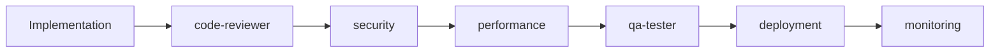
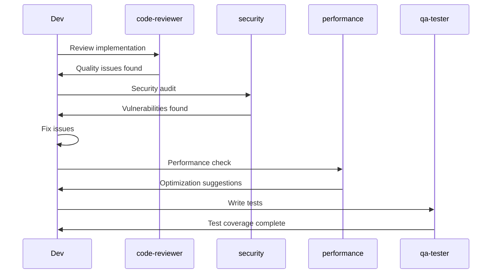

# Cross-Cutting Specialists

Cross-cutting specialists are domain experts that work across all technology stacks. They focus on specific concerns like security, testing, performance, and deployment that apply regardless of the frontend or backend framework being used.

## Overview

Cross-cutting specialists include:

- **code-reviewer** - Code quality and best practices
- **qa-tester** - Testing strategies and implementation
- **security** - Security audits and OWASP compliance
- **performance** - Optimization and Core Web Vitals
- **deployment** - CI/CD and infrastructure
- **database** - Schema design and query optimization
- **monitoring** - Observability and error tracking
- **architect** - System design and scalability
- **tech-writer** - Technical documentation

## code-reviewer

**Name:** `code-reviewer`

**Description:** Expert in code quality, best practices, and comprehensive code review.

### Expertise Areas

- TypeScript type safety and best practices
- React and Next.js patterns
- Server vs Client Component usage
- Error handling and resilience
- Security vulnerability detection
- Performance anti-patterns
- Code smell identification
- Refactoring suggestions

### When to Use

- After implementing features
- Before merging pull requests
- Ensuring code quality
- Learning best practices
- Identifying technical debt

### Usage Example

```bash
Use code-reviewer to review my blog post implementation for best practices and potential issues
```

---

## qa-tester

**Name:** `qa-tester`

**Description:** Expert in comprehensive testing strategies with Playwright E2E and Vitest unit testing.

### Expertise Areas

- **Playwright E2E Testing** - Browser automation, cross-browser testing
- **Vitest Unit Testing** - Fast unit tests with excellent DX
- **React Testing Library** - Component testing
- **Server Actions Testing** - Testing Next.js Server Actions
- **Test Coverage** - Ensuring comprehensive coverage
- **Page Object Model** - Maintainable test architecture
- **API Testing** - Testing REST and tRPC endpoints
- **Accessibility Testing** - Automated a11y checks

### When to Use

- Writing end-to-end tests
- Creating unit tests
- Testing critical user flows
- Improving test coverage
- Setting up testing infrastructure
- Debugging test failures

### Usage Example

```bash
Use qa-tester to write Playwright E2E tests for the user authentication flow including login, signup, and password reset
```

---

## security

**Name:** `security`

**Description:** Expert in application security and OWASP Top 10 compliance.

### Expertise Areas

- **OWASP Top 10** - Complete coverage of top security risks
- **Authentication & Authorization** - Secure implementation
- **Input Validation** - SQL injection, XSS prevention
- **Encryption** - Data at rest and in transit
- **Security Headers** - CSP, HSTS, X-Frame-Options
- **Rate Limiting** - DDoS protection
- **Audit Logging** - Security event tracking
- **Dependency Scanning** - Vulnerable package detection
- **Multi-Factor Authentication** - 2FA/MFA implementation

### When to Use

- Before production deployment
- After authentication changes
- Regular security audits
- Compliance requirements
- Investigating security incidents
- Hardening applications

### Usage Example

```bash
Use security to perform a comprehensive security audit of my application focusing on authentication and data protection
```

---

## performance

**Name:** `performance`

**Description:** Expert in web performance optimization and Core Web Vitals.

### Expertise Areas

- **Core Web Vitals** - LCP, FID/INP, CLS optimization
- **Bundle Size** - JavaScript and CSS optimization
- **Code Splitting** - Dynamic imports and lazy loading
- **Image Optimization** - next/image best practices
- **Font Optimization** - next/font usage
- **Caching Strategies** - Browser, CDN, server caching
- **Database Optimization** - Query optimization, indexing
- **Streaming & Suspense** - Progressive rendering

### When to Use

- Improving page load times
- Reducing bundle size
- Optimizing Core Web Vitals
- Addressing performance issues
- Pre-launch optimization
- Regular performance audits

### Usage Example

```bash
Use performance to analyze my application and provide recommendations for improving Core Web Vitals scores
```

---

## deployment

**Name:** `deployment`

**Description:** Expert in deployment strategies, CI/CD pipelines, and infrastructure.

### Expertise Areas

- **Vercel Deployment** - Configuration and optimization
- **Docker** - Containerization and multi-stage builds
- **Kubernetes** - Orchestration and scaling
- **GitHub Actions** - CI/CD workflows
- **Environment Management** - Secrets and configuration
- **Database Migrations** - Zero-downtime migrations
- **Blue-Green Deployments** - Rollback strategies
- **Health Checks** - Monitoring deployment status
- **CDN Configuration** - Edge caching and distribution

### When to Use

- Deploying to production
- Setting up CI/CD pipelines
- Configuring infrastructure
- Implementing deployment strategies
- Troubleshooting deployment issues
- Automating releases

### Usage Example

```bash
Use deployment to set up a complete CI/CD pipeline with GitHub Actions for deploying my Next.js app to Vercel
```

---

## database

**Name:** `database`

**Description:** Expert in PostgreSQL, Prisma ORM, and database optimization.

### Expertise Areas

- **Prisma Schema Design** - Models, relations, enums
- **Migrations** - Versioning and management
- **Query Optimization** - Efficient queries
- **Indexing** - Performance indexes
- **Transactions** - ACID compliance
- **N+1 Prevention** - Query batching
- **Connection Pooling** - Resource management
- **Full-Text Search** - PostgreSQL search features
- **Data Modeling** - Normalization and design patterns

### When to Use

- Designing database schemas
- Creating migrations
- Optimizing queries
- Preventing N+1 problems
- Database performance tuning
- Data modeling decisions

### Usage Example

```bash
Use database to design a Prisma schema for a multi-tenant SaaS application with users, organizations, and projects
```

---

## monitoring

**Name:** `monitoring`

**Description:** Expert in observability, error tracking, and application monitoring.

### Expertise Areas

- **Sentry** - Error tracking and alerting
- **OpenTelemetry** - Distributed tracing
- **Structured Logging** - Pino, Winston
- **Metrics & Dashboards** - Application metrics
- **Uptime Monitoring** - Health checks
- **APM** - Application performance monitoring
- **Real User Monitoring** - RUM metrics
- **Alerting** - Notification strategies
- **Log Aggregation** - Centralized logging

### When to Use

- Setting up error tracking
- Implementing logging
- Creating dashboards
- Configuring alerts
- Troubleshooting issues
- Understanding user experience

### Usage Example

```bash
Use monitoring to set up comprehensive monitoring with Sentry for error tracking and OpenTelemetry for distributed tracing
```

---

## architect

**Name:** `architect`

**Description:** Expert in system architecture, design patterns, and scalability.

### Expertise Areas

- **Architecture Patterns** - Monolith, microservices, serverless
- **Design Patterns** - Repository, Service, Factory patterns
- **Scalability** - Horizontal and vertical scaling
- **Event-Driven** - Event sourcing, CQRS
- **Caching Strategies** - Multi-layer caching
- **Database Scaling** - Read replicas, sharding
- **API Design** - REST, tRPC, GraphQL
- **Resilience Patterns** - Circuit breaker, retry logic
- **Future-Proofing** - Extensibility and maintainability

### When to Use

- Designing system architecture
- Planning scalability
- Making architectural decisions
- Refactoring architecture
- Solving scaling challenges
- Technology selection

### Usage Example

```bash
Use architect to design a scalable architecture for a real-time collaboration platform that needs to support 100,000 concurrent users
```

---

## tech-writer

**Name:** `tech-writer`

**Description:** Expert in technical documentation with MkDocs Material.

### Expertise Areas

- **MkDocs Material** - Documentation sites
- **Professional Styling** - Custom CSS and themes
- **API Documentation** - REST and tRPC endpoints
- **User Guides** - Getting started, tutorials
- **README Files** - Project documentation
- **Architecture Docs** - System diagrams with Mermaid
- **Code Documentation** - Inline and API docs
- **Deployment Docs** - Setup and configuration
- **Accessibility** - WCAG-compliant documentation

### When to Use

- Creating project documentation
- Writing API references
- Building documentation sites
- Documenting architecture
- Creating user guides
- Generating README files

### Usage Example

```bash
Use tech-writer to create comprehensive documentation for my API including getting started guide, endpoint reference, and deployment instructions
```

---

## Best Practices

### 1. Use Cross-Cutting Specialists Proactively

Don't wait until issues arise:

```bash
# Regular security audits
/mcp-review-security

# Continuous performance monitoring
/mcp-review-performance

# Ongoing code quality checks
/mcp-review-code
```

### 2. Combine Multiple Specialists

For comprehensive quality assurance:

```bash
# After implementation
Use code-reviewer to review code quality
Use security to audit security
Use performance to check performance
Use qa-tester to write tests
```

### 3. Leverage for Learning

Ask specialists about best practices:

```bash
Use security to explain OWASP Top 10 vulnerabilities and how to prevent them in Next.js
```

### 4. Integrate into Workflow

Make specialists part of your regular workflow:



## Specialist Coordination

Cross-cutting specialists often work together:



## When to Use Which Specialist

### Before Deployment Checklist

```bash
# 1. Code quality
Use code-reviewer to review all code

# 2. Security
Use security to perform security audit

# 3. Performance
Use performance to check Core Web Vitals

# 4. Testing
Use qa-tester to ensure test coverage

# 5. Documentation
Use tech-writer to verify documentation

# 6. Deployment
Use deployment to configure CI/CD

# 7. Monitoring
Use monitoring to set up error tracking
```

### During Development

- **code-reviewer** - After each feature
- **qa-tester** - Alongside implementation
- **database** - For schema changes
- **performance** - For optimization needs

### Periodic Reviews

- **security** - Monthly audits
- **performance** - Weekly checks
- **architect** - Quarterly reviews
- **monitoring** - Dashboard reviews

## Summary

Cross-cutting specialists provide:

- **Universal Expertise** - Works with all stacks
- **Quality Assurance** - Security, performance, testing
- **Best Practices** - Industry standards
- **Specialized Knowledge** - Deep domain expertise

## Next Steps

- [View savant agents](savants.md)
- [View JavaScript specialists](javascript-specialists.md)
- [Learn workflow commands](../architecture/workflow-commands.md)
- [See best practices](../guides/best-practices.md)
