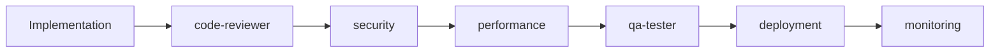
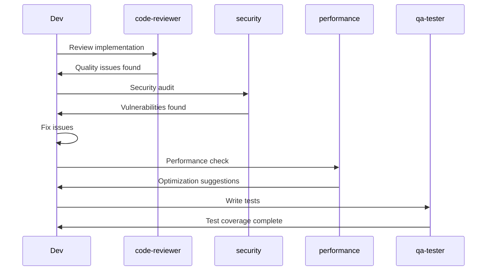

# Cross-Cutting Specialists

Cross-cutting specialists are domain experts that work across all technology stacks. They focus on specific concerns like security, testing, performance, and deployment that apply regardless of the frontend or backend framework being used.

## Overview

Cross-cutting specialists include:

- **product-manager** - Product Requirements Documents (PRDs) and requirements analysis
- **task-planner** - Development task breakdown and sprint planning
- **test-planner** - Test case generation and coverage analysis
- **code-reviewer** - Code quality and best practices
- **qa-tester** - Testing strategies and implementation
- **security** - Security audits and OWASP compliance
- **performance** - Optimization and Core Web Vitals
- **deployment** - CI/CD and infrastructure
- **database** - Schema design and query optimization
- **monitoring** - Observability and error tracking
- **tech-writer** - Technical documentation

For architecture-related specialists, see the dedicated [Architecture Agents](architecture-agents.md) page.

## product-manager

**Name:** `product-manager`

**Description:** Expert product manager specializing in creating lean, actionable Product Requirements Documents (PRDs) for agile development teams. Analyzes BRDs, user manuals, and system requirements to generate comprehensive PRDs.

### Expertise Areas

- **PRD Generation** - Creating agile, actionable Product Requirements Documents
- **Requirements Analysis** - Extracting requirements from BRDs, user manuals, technical specs
- **User Story Writing** - "As a [user], I want to [action], so that [benefit]"
- **Acceptance Criteria** - Defining clear, testable acceptance criteria
- **Feature Prioritization** - P0 (Must-have), P1 (Should-have), P2 (Nice-to-have)
- **Success Metrics** - Defining measurable success criteria with baselines
- **Technical Context** - Documenting constraints, dependencies, and assumptions
- **Stakeholder Communication** - Bridging business and technical teams

### PRD Structure (5-Section Format)

1. **Objective & Success Metrics** - Problem statement, goals, metrics
2. **Features & Requirements** - Prioritized features with user stories and functional requirements
3. **User Experience Flow** - High-level user journeys and key interactions
4. **Technical Context** - System requirements, dependencies, constraints, assumptions
5. **Open Questions & Next Steps** - Unresolved questions, risks, mitigation, timeline

### When to Use

- Converting Business Requirements Documents (BRDs) to PRDs
- Consolidating multiple requirement documents
- Creating PRDs from scratch for new features/products
- Analyzing user manuals to extract requirements
- Validating that requirements are complete and testable
- Structuring scattered requirements into actionable format
- Before starting implementation (ensures clarity and alignment)

### Input Document Support

The agent can analyze and synthesize:

- Business Requirements Documents (BRDs)
- User manuals and existing documentation
- System requirements and technical specifications
- User research findings
- Competitive analysis
- Multiple requirement documents (consolidation)

### Usage Examples

**Example 1: Creating PRD from BRD**
```bash
Use product-manager to create a PRD from this BRD document: /docs/auth-feature-brd.md
```

**Example 2: Creating PRD from Multiple Sources**
```bash
Use product-manager to create a PRD for the new dashboard feature.

Input documents:
- Business requirements: /docs/dashboard-brd.md
- User research: /docs/user-research.md
- Technical constraints: /docs/tech-spec.md
```

**Example 3: Creating PRD from Conversation**
```bash
Use product-manager to create a PRD for a real-time chat feature.

Context:
- Users need to send messages in real-time
- Must support file attachments (images, PDFs)
- Should show typing indicators
- Mobile-first design
- Must integrate with existing auth system
```

**Example 4: Analyzing Existing Requirements**
```bash
Use product-manager to analyze all requirements in /docs/requirements/ and create a consolidated PRD
```

### Quality Standards

A high-quality agile PRD:

- ✅ Can be read and understood in 15-20 minutes
- ✅ Provides enough detail for development to start
- ✅ Can be broken into sprint-sized chunks easily
- ✅ Answers the "why" before the "what"
- ✅ Includes clear acceptance criteria
- ✅ Acknowledges what's unknown (Open Questions)
- ✅ Defines measurable success metrics

### Length Guidelines

- **Lightweight PRD**: 2-3 pages (simple features)
- **Standard PRD**: 3-5 pages (typical features)
- **Complex PRD**: 5-8 pages (major features/products)

### Interaction with Other Agents

After creating a PRD, may delegate to:

- **task-planner** - Break down PRD into development tasks
- **test-planner** - Generate test cases from PRD
- **solution-architect** - Enterprise-level, multi-system architecture
- **solution-designer** - Detailed technical design and API specifications
- **software-architect** - Application-level architecture design
- **frontend-ui** - Detailed UI/UX design after PRD approval
- **backend-api** - API design and implementation
- **database** - Data model and schema design
- **security** - Security requirements analysis
- **qa-tester** - Test plan creation based on acceptance criteria
- **tech-writer** - User-facing documentation

---

## task-planner

**Name:** `task-planner`

**Description:** Expert technical lead and project manager specializing in breaking down Product Requirements Documents (PRDs) into actionable development tasks. Generates comprehensive task lists covering all implementation phases from setup to deployment.

### Expertise Areas

- **Task Breakdown** - Decomposing features into 4-40 hour tasks
- **Effort Estimation** - Realistic time estimates for development work
- **Dependency Management** - Proper task sequencing and dependency chains
- **Role Assignment** - Frontend, Backend, Fullstack, QA, DevOps, Mobile, Security
- **Priority Assignment** - High (P0), Medium (P1), Low (P2) based on PRD
- **Phase Organization** - Setup, Backend, Frontend, Integration, Testing, Deployment
- **JSON Output** - Pure JSON array format for import into project tools
- **Sprint Planning** - Breaking features into sprint-sized work items

### Task Structure (JSON Format)

Each task includes:

- **task_id**: `TASK-001`, `TASK-002`, etc. (sequential, unique)
- **title**: Brief, action-oriented summary (5-10 words)
- **description**: Detailed explanation with technical details (2-4 sentences)
- **priority**: `"High"`, `"Medium"`, `"Low"`
- **effort**: Estimated hours (1-40 hours)
- **role**: `"Frontend"`, `"Backend"`, `"Fullstack"`, `"QA"`, `"DevOps"`, `"Mobile"`, `"Security"`
- **dependencies**: Comma-separated task IDs or `"None"`

### When to Use

- Converting PRD to development tasks
- Sprint planning and estimation
- Project planning with dependencies
- Team workload distribution
- Importing tasks into Jira, Linear, GitHub Issues
- Creating implementation roadmap

### Output Files

**Generates TWO files** in `documents/02-dev-tasks/`:

- `[feature-name]-tasks.json` - For Jira, Linear, GitHub Issues (API import)
- `[feature-name]-tasks.csv` - For Excel, Google Sheets (manual import)

### Usage Examples

**Example 1: Generate tasks from PRD**
```bash
Use task-planner to generate development tasks from documents/01-prds/user-authentication-prd.md
```

**Outputs**:

- `documents/02-dev-tasks/user-authentication-tasks.json`
- `documents/02-dev-tasks/user-authentication-tasks.csv`

**Example 2: With team context**
```bash
Use task-planner to create task breakdown for documents/01-prds/payment-processing-prd.md

Team: 2 Backend (Node.js), 2 Frontend (React), 1 QA, 1 DevOps
Tech stack: Next.js 15, tRPC, Prisma, PostgreSQL
```

**Example 3: Specific priority only**
```bash
Use task-planner to generate only High priority (P0) tasks from documents/01-prds/mvp-prd.md
```

### Task Phases

1. **Project Setup** - Repository, environment, CI/CD, database setup
2. **Backend Development** - Database schema, APIs, business logic, validation
3. **Frontend Development** - UI components, state management, API integration
4. **Integration** - Frontend-backend integration, third-party services
5. **Testing & QA** - Integration tests, E2E tests, performance, security
6. **Deployment** - Production setup, deployment pipeline, monitoring

### Effort Estimation Guidelines

- **Backend**: Simple CRUD (2-4h), Complex endpoint (4-8h), Integration (8-16h)
- **Frontend**: Simple component (2-4h), Complex component (4-8h), Page (6-12h)
- **QA**: Test plan (4-8h), Integration tests (8-16h), E2E tests (12-24h)
- **DevOps**: Project setup (4-8h), CI/CD pipeline (8-16h), Monitoring (4-8h)

### Interaction with Other Agents

After creating tasks, may delegate to:

- **fullstack-js-savant** - Architecture decisions before implementation
- **backend-api** - Backend task implementation
- **frontend-ui** - Frontend task implementation
- **qa-tester** - QA task implementation
- **deployment** - Deployment task implementation

---

## test-planner

**Name:** `test-planner`

**Description:** Expert QA Lead specializing in comprehensive test strategy and test case generation. Analyzes Product Requirements Documents (PRDs) to create thorough test suites covering functional, integration, E2E, security, and performance testing.

### Expertise Areas

- **Test Coverage Strategy** - Positive, negative, boundary, edge cases
- **Test Types** - Functional, Integration, E2E, Security, Performance, Usability
- **Test Case Design** - Clear steps, measurable expected results, prerequisites
- **Requirements Mapping** - Each PRD requirement has corresponding test cases
- **Priority Assignment** - High (P0), Medium (P1), Low (P2) based on criticality
- **JSON Output** - Pure JSON array format for import into test management tools
- **Acceptance Criteria Validation** - Tests map to PRD acceptance criteria
- **Security Testing** - SQL injection, XSS, authentication, authorization

### Test Case Structure (JSON Format)

Each test case includes:

- **test_id**: `TEST-001`, `TEST-002`, etc. (sequential, unique)
- **scenario**: Clear description of what is being tested (10-15 words)
- **steps**: Numbered, step-by-step instructions with `\n` line breaks
- **expected**: Specific, measurable expected behavior
- **priority**: `"High"`, `"Medium"`, `"Low"`
- **type**: `"Functional"`, `"Integration"`, `"E2E"`, `"Performance"`, `"Security"`, `"Usability"`, `"Boundary"`, `"Negative"`
- **prerequisites**: Conditions required before test execution or `"None"`

### When to Use

- Converting PRD to test cases
- Test planning and coverage analysis
- QA estimation
- Creating manual test scripts
- Importing tests into TestRail, Zephyr, qTest
- Ensuring acceptance criteria coverage

### Output Files

**Generates TWO files** in `documents/03-test-cases/`:

- `[feature-name]-tests.json` - For TestRail, Zephyr, qTest (API import)
- `[feature-name]-tests.csv` - For Excel, Google Sheets (manual import)

### Usage Examples

**Example 1: Generate test cases from PRD**
```bash
Use test-planner to generate test cases from documents/01-prds/user-authentication-prd.md
```

**Outputs**:

- `documents/03-test-cases/user-authentication-tests.json`
- `documents/03-test-cases/user-authentication-tests.csv`

**Example 2: Security-focused testing**
```bash
Use test-planner to generate security-focused test cases from documents/01-prds/payment-processing-prd.md

Focus on:
- Authentication/authorization
- SQL injection prevention
- XSS prevention
- CSRF protection
```

**Example 3: Specific feature only**
```bash
Use test-planner to generate test cases only for User Registration feature from documents/01-prds/full-prd.md
```

### Test Coverage Distribution

Comprehensive test suite includes:

- **50-60%** Positive/Functional tests (happy paths)
- **20-30%** Negative tests (error handling, invalid inputs)
- **10-15%** Boundary tests (limits, edge values)
- **15-20%** Integration tests (component interactions)
- **10-15%** E2E tests (complete user journeys)
- **5-10%** Security tests (auth, vulnerabilities)
- **5-10%** Performance tests (load, speed)
- **5%** Usability/Accessibility tests

### Test Types Explained

- **Functional**: Tests specific feature functionality (most common)
- **Integration**: Tests interaction between components/systems
- **E2E**: Tests complete user journeys across the system
- **Performance**: Tests speed, load, scalability
- **Security**: Tests authentication, authorization, data protection
- **Usability**: Tests user experience, accessibility
- **Boundary**: Tests limits and edge cases
- **Negative**: Tests error handling and invalid inputs

### Interaction with Other Agents

After creating test cases, may delegate to:

- **qa-tester** - Implement automated tests based on test cases
- **security** - Deep security testing beyond standard cases
- **performance** - Detailed performance testing
- **product-manager** - Clarify requirements if test gaps found

---

## code-reviewer

**Name:** `code-reviewer`

**Description:** Expert in code quality, best practices, and comprehensive code review.

### Expertise Areas

- TypeScript type safety and best practices
- React and Next.js patterns
- Server vs Client Component usage
- Error handling and resilience
- Security vulnerability detection
- Performance anti-patterns
- Code smell identification
- Refactoring suggestions

### When to Use

- After implementing features
- Before merging pull requests
- Ensuring code quality
- Learning best practices
- Identifying technical debt

### Usage Example

```bash
Use code-reviewer to review my blog post implementation for best practices and potential issues
```

---

## qa-tester

**Name:** `qa-tester`

**Description:** Expert in comprehensive testing strategies with Playwright E2E and Vitest unit testing.

### Expertise Areas

- **Playwright E2E Testing** - Browser automation, cross-browser testing
- **Vitest Unit Testing** - Fast unit tests with excellent DX
- **React Testing Library** - Component testing
- **Server Actions Testing** - Testing Next.js Server Actions
- **Test Coverage** - Ensuring comprehensive coverage
- **Page Object Model** - Maintainable test architecture
- **API Testing** - Testing REST and tRPC endpoints
- **Accessibility Testing** - Automated a11y checks

### When to Use

- Writing end-to-end tests
- Creating unit tests
- Testing critical user flows
- Improving test coverage
- Setting up testing infrastructure
- Debugging test failures

### Usage Example

```bash
Use qa-tester to write Playwright E2E tests for the user authentication flow including login, signup, and password reset
```

---

## security

**Name:** `security`

**Description:** Expert in application security and OWASP Top 10 compliance.

### Expertise Areas

- **OWASP Top 10** - Complete coverage of top security risks
- **Authentication & Authorization** - Secure implementation
- **Input Validation** - SQL injection, XSS prevention
- **Encryption** - Data at rest and in transit
- **Security Headers** - CSP, HSTS, X-Frame-Options
- **Rate Limiting** - DDoS protection
- **Audit Logging** - Security event tracking
- **Dependency Scanning** - Vulnerable package detection
- **Multi-Factor Authentication** - 2FA/MFA implementation

### When to Use

- Before production deployment
- After authentication changes
- Regular security audits
- Compliance requirements
- Investigating security incidents
- Hardening applications

### Usage Example

```bash
Use security to perform a comprehensive security audit of my application focusing on authentication and data protection
```

---

## performance

**Name:** `performance`

**Description:** Expert in web performance optimization and Core Web Vitals.

### Expertise Areas

- **Core Web Vitals** - LCP, FID/INP, CLS optimization
- **Bundle Size** - JavaScript and CSS optimization
- **Code Splitting** - Dynamic imports and lazy loading
- **Image Optimization** - next/image best practices
- **Font Optimization** - next/font usage
- **Caching Strategies** - Browser, CDN, server caching
- **Database Optimization** - Query optimization, indexing
- **Streaming & Suspense** - Progressive rendering

### When to Use

- Improving page load times
- Reducing bundle size
- Optimizing Core Web Vitals
- Addressing performance issues
- Pre-launch optimization
- Regular performance audits

### Usage Example

```bash
Use performance to analyze my application and provide recommendations for improving Core Web Vitals scores
```

---

## deployment

**Name:** `deployment`

**Description:** Expert in deployment strategies, CI/CD pipelines, and infrastructure.

### Expertise Areas

- **Vercel Deployment** - Configuration and optimization
- **Docker** - Containerization and multi-stage builds
- **Kubernetes** - Orchestration and scaling
- **GitHub Actions** - CI/CD workflows
- **Environment Management** - Secrets and configuration
- **Database Migrations** - Zero-downtime migrations
- **Blue-Green Deployments** - Rollback strategies
- **Health Checks** - Monitoring deployment status
- **CDN Configuration** - Edge caching and distribution

### When to Use

- Deploying to production
- Setting up CI/CD pipelines
- Configuring infrastructure
- Implementing deployment strategies
- Troubleshooting deployment issues
- Automating releases

### Usage Example

```bash
Use deployment to set up a complete CI/CD pipeline with GitHub Actions for deploying my Next.js app to Vercel
```

---

## database

**Name:** `database`

**Description:** Expert in PostgreSQL, Prisma ORM, and database optimization.

### Expertise Areas

- **Prisma Schema Design** - Models, relations, enums
- **Migrations** - Versioning and management
- **Query Optimization** - Efficient queries
- **Indexing** - Performance indexes
- **Transactions** - ACID compliance
- **N+1 Prevention** - Query batching
- **Connection Pooling** - Resource management
- **Full-Text Search** - PostgreSQL search features
- **Data Modeling** - Normalization and design patterns

### When to Use

- Designing database schemas
- Creating migrations
- Optimizing queries
- Preventing N+1 problems
- Database performance tuning
- Data modeling decisions

### Usage Example

```bash
Use database to design a Prisma schema for a multi-tenant SaaS application with users, organizations, and projects
```

---

## monitoring

**Name:** `monitoring`

**Description:** Expert in observability, error tracking, and application monitoring.

### Expertise Areas

- **Sentry** - Error tracking and alerting
- **OpenTelemetry** - Distributed tracing
- **Structured Logging** - Pino, Winston
- **Metrics & Dashboards** - Application metrics
- **Uptime Monitoring** - Health checks
- **APM** - Application performance monitoring
- **Real User Monitoring** - RUM metrics
- **Alerting** - Notification strategies
- **Log Aggregation** - Centralized logging

### When to Use

- Setting up error tracking
- Implementing logging
- Creating dashboards
- Configuring alerts
- Troubleshooting issues
- Understanding user experience

### Usage Example

```bash
Use monitoring to set up comprehensive monitoring with Sentry for error tracking and OpenTelemetry for distributed tracing
```

---

## tech-writer

**Name:** `tech-writer`

**Description:** Expert in technical documentation with MkDocs Material.

### Expertise Areas

- **MkDocs Material** - Documentation sites
- **Professional Styling** - Custom CSS and themes
- **API Documentation** - REST and tRPC endpoints
- **User Guides** - Getting started, tutorials
- **README Files** - Project documentation
- **Architecture Docs** - System diagrams with Mermaid
- **Code Documentation** - Inline and API docs
- **Deployment Docs** - Setup and configuration
- **Accessibility** - WCAG-compliant documentation

### When to Use

- Creating project documentation
- Writing API references
- Building documentation sites
- Documenting architecture
- Creating user guides
- Generating README files

### Usage Example

```bash
Use tech-writer to create comprehensive documentation for my API including getting started guide, endpoint reference, and deployment instructions
```

---

## Best Practices

### 1. Use Cross-Cutting Specialists Proactively

Don't wait until issues arise:

```bash
# Regular security audits
/mcp-review-security

# Continuous performance monitoring
/mcp-review-performance

# Ongoing code quality checks
/mcp-review-code
```

### 2. Combine Multiple Specialists

For comprehensive quality assurance:

```bash
# After implementation
Use code-reviewer to review code quality
Use security to audit security
Use performance to check performance
Use qa-tester to write tests
```

### 3. Leverage for Learning

Ask specialists about best practices:

```bash
Use security to explain OWASP Top 10 vulnerabilities and how to prevent them in Next.js
```

### 4. Integrate into Workflow

Make specialists part of your regular workflow:



## Specialist Coordination

Cross-cutting specialists often work together:



## When to Use Which Specialist

### Before Deployment Checklist

```bash
# 1. Code quality
Use code-reviewer to review all code

# 2. Security
Use security to perform security audit

# 3. Performance
Use performance to check Core Web Vitals

# 4. Testing
Use qa-tester to ensure test coverage

# 5. Documentation
Use tech-writer to verify documentation

# 6. Deployment
Use deployment to configure CI/CD

# 7. Monitoring
Use monitoring to set up error tracking
```

### During Development

- **code-reviewer** - After each feature
- **qa-tester** - Alongside implementation
- **database** - For schema changes
- **performance** - For optimization needs

### Periodic Reviews

- **security** - Monthly audits
- **performance** - Weekly checks
- **software-architect** - Quarterly reviews
- **monitoring** - Dashboard reviews

## Summary

Cross-cutting specialists provide:

- **Universal Expertise** - Works with all stacks
- **Quality Assurance** - Security, performance, testing
- **Best Practices** - Industry standards
- **Specialized Knowledge** - Deep domain expertise

## Next Steps

- [View savant agents](savants.md)
- [View JavaScript specialists](javascript-specialists.md)
- [Learn workflow commands](../architecture/workflow-commands.md)
- [See best practices](../guides/best-practices.md)
