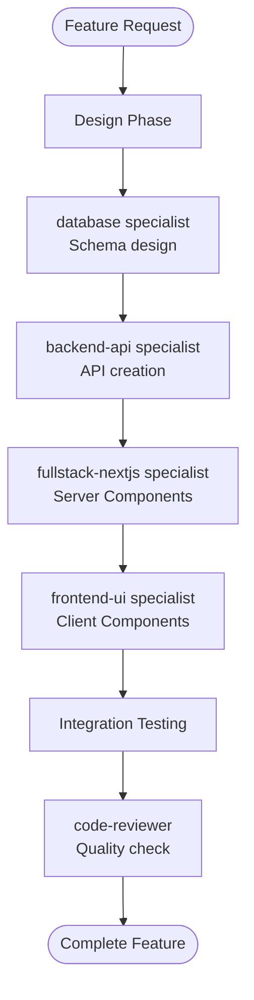

# JavaScript Specialists

JavaScript specialists are deep domain experts focusing on specific frameworks and tools within the JavaScript/TypeScript ecosystem. They provide detailed implementations, best practices, and production-ready code.

## Overview

The JavaScript specialist agents cover:

- **fullstack-nextjs** - Next.js 15+ with App Router and Server Components
- **frontend-ui** - shadcn/ui, Tailwind CSS, and accessibility
- **backend-api** - tRPC, REST APIs, and NextAuth.js authentication

## fullstack-nextjs

**Name:** `fullstack-nextjs`

**Description:** Expert in Next.js 15+ development with App Router, Server Components, and modern full-stack patterns.

### Core Expertise

- **Next.js 15 App Router** - File-based routing, layouts, route groups
- **React Server Components** - Server-first data fetching
- **Server Actions** - Form handling and mutations
- **Data Fetching** - Parallel fetching, streaming, caching
- **Metadata & SEO** - Static and dynamic metadata
- **Route Handlers** - API endpoints
- **Middleware** - Authentication, rate limiting
- **Streaming & Suspense** - Progressive rendering
- **Error Handling** - Error boundaries, not-found pages

### When to Use

- Building Next.js applications with App Router
- Implementing Server Components and Server Actions
- Setting up routing, layouts, and navigation
- Data fetching and caching strategies
- Building full-stack features with Next.js
- Configuring metadata and SEO

### Usage Examples

**Server Component Page:**
```bash
Use fullstack-nextjs to create a blog post listing page with Server Components and pagination
```

**Server Actions:**
```bash
Use fullstack-nextjs to implement a create post form with Server Actions and validation
```

**Streaming:**
```bash
Use fullstack-nextjs to add streaming and Suspense to the dashboard page
```

### Code Example

Server Component with data fetching:

```typescript
// app/posts/page.tsx
import { db } from '@/lib/db'
import { PostCard } from '@/components/post-card'

export default async function PostsPage() {
  const posts = await db.post.findMany({
    orderBy: { createdAt: 'desc' },
    include: { author: true },
  })

  return (
    <div className="container py-8">
      <h1 className="text-3xl font-bold mb-8">Blog Posts</h1>
      <div className="grid gap-6 md:grid-cols-2 lg:grid-cols-3">
        {posts.map((post) => (
          <PostCard key={post.id} post={post} />
        ))}
      </div>
    </div>
  )
}
```

---

## frontend-ui

**Name:** `frontend-ui`

**Description:** Expert in modern UI/UX with shadcn/ui, Tailwind CSS, and accessibility best practices.

### Core Expertise

- **shadcn/ui** - Component installation and customization
- **Tailwind CSS** - Responsive design, utility classes
- **Radix UI** - Accessible primitives
- **React Hook Form** - Form handling with validation
- **Zod** - Schema validation
- **TanStack Table** - Data tables
- **Accessibility** - WCAG AA compliance, ARIA
- **Dark Mode** - Theme switching
- **Framer Motion** - Animations
- **Responsive Design** - Mobile-first approach

### When to Use

- Building UI components and layouts
- Creating forms with validation
- Ensuring accessibility
- Implementing responsive design
- Adding animations and interactions
- Setting up design systems

### Usage Examples

**Form with Validation:**
```bash
Use frontend-ui to create a signup form with email, password, and name fields using shadcn/ui and Zod validation
```

**Data Table:**
```bash
Use frontend-ui to build a data table for displaying users with sorting, filtering, and pagination
```

**Accessible Modal:**
```bash
Use frontend-ui to create an accessible modal dialog for confirming delete actions
```

### Code Example

Form with react-hook-form and Zod:

```typescript
'use client'

import { useForm } from 'react-hook-form'
import { zodResolver } from '@hookform/resolvers/zod'
import * as z from 'zod'
import { Button } from '@/components/ui/button'
import { Input } from '@/components/ui/input'
import {
  Form,
  FormControl,
  FormField,
  FormItem,
  FormLabel,
  FormMessage,
} from '@/components/ui/form'

const formSchema = z.object({
  email: z.string().email('Invalid email address'),
  password: z.string().min(8, 'Password must be at least 8 characters'),
  name: z.string().min(2, 'Name must be at least 2 characters'),
})

export function SignupForm() {
  const form = useForm<z.infer<typeof formSchema>>({
    resolver: zodResolver(formSchema),
    defaultValues: {
      email: '',
      password: '',
      name: '',
    },
  })

  async function onSubmit(values: z.infer<typeof formSchema>) {
    // Handle signup
    console.log(values)
  }

  return (
    <Form {...form}>
      <form onSubmit={form.handleSubmit(onSubmit)} className="space-y-4">
        <FormField
          control={form.control}
          name="name"
          render={({ field }) => (
            <FormItem>
              <FormLabel>Name</FormLabel>
              <FormControl>
                <Input placeholder="John Doe" {...field} />
              </FormControl>
              <FormMessage />
            </FormItem>
          )}
        />
        <FormField
          control={form.control}
          name="email"
          render={({ field }) => (
            <FormItem>
              <FormLabel>Email</FormLabel>
              <FormControl>
                <Input type="email" placeholder="john@example.com" {...field} />
              </FormControl>
              <FormMessage />
            </FormItem>
          )}
        />
        <FormField
          control={form.control}
          name="password"
          render={({ field }) => (
            <FormItem>
              <FormLabel>Password</FormLabel>
              <FormControl>
                <Input type="password" {...field} />
              </FormControl>
              <FormMessage />
            </FormItem>
          )}
        />
        <Button type="submit" className="w-full">
          Sign Up
        </Button>
      </form>
    </Form>
  )
}
```

---

## backend-api

**Name:** `backend-api`

**Description:** Expert in type-safe APIs with tRPC, REST APIs, and NextAuth.js authentication.

### Core Expertise

- **tRPC** - End-to-end type safety, React Query integration
- **REST APIs** - Route Handlers, RESTful design
- **NextAuth.js v5** - Authentication and session management
- **OAuth Providers** - GitHub, Google, etc.
- **JWT & Sessions** - Token-based and session-based auth
- **API Middleware** - Rate limiting, CORS, validation
- **Zod Validation** - Input validation and transformation
- **Error Handling** - Structured error responses
- **Authorization** - Role-based access control

### When to Use

- Creating APIs (tRPC or REST)
- Implementing authentication
- Setting up OAuth providers
- Adding API middleware
- Input validation
- Authorization logic

### Usage Examples

**tRPC Router:**
```bash
Use backend-api to create a tRPC router for managing blog posts with create, update, delete, and list operations
```

**Authentication:**
```bash
Use backend-api to implement NextAuth.js with email/password and GitHub OAuth
```

**API Middleware:**
```bash
Use backend-api to add rate limiting middleware to the API routes
```

### Code Example

tRPC Router with authorization:

```typescript
// server/routers/post.ts
import { z } from 'zod'
import { router, publicProcedure, protectedProcedure } from '../trpc'

const createPostSchema = z.object({
  title: z.string().min(1).max(255),
  content: z.string().min(1),
  published: z.boolean().default(false),
})

export const postRouter = router({
  list: publicProcedure
    .input(
      z.object({
        limit: z.number().min(1).max(100).default(10),
        cursor: z.string().optional(),
      })
    )
    .query(async ({ ctx, input }) => {
      const posts = await ctx.db.post.findMany({
        take: input.limit + 1,
        cursor: input.cursor ? { id: input.cursor } : undefined,
        orderBy: { createdAt: 'desc' },
        where: { published: true },
      })

      let nextCursor: string | undefined = undefined
      if (posts.length > input.limit) {
        const nextItem = posts.pop()
        nextCursor = nextItem!.id
      }

      return { posts, nextCursor }
    }),

  byId: publicProcedure
    .input(z.object({ id: z.string() }))
    .query(async ({ ctx, input }) => {
      const post = await ctx.db.post.findUnique({
        where: { id: input.id },
        include: { author: true },
      })
      if (!post) throw new Error('Post not found')
      return post
    }),

  create: protectedProcedure
    .input(createPostSchema)
    .mutation(async ({ ctx, input }) => {
      return ctx.db.post.create({
        data: {
          ...input,
          authorId: ctx.session.user.id,
        },
      })
    }),

  update: protectedProcedure
    .input(
      z.object({
        id: z.string(),
        data: createPostSchema.partial(),
      })
    )
    .mutation(async ({ ctx, input }) => {
      const post = await ctx.db.post.findUnique({
        where: { id: input.id },
      })

      if (!post) throw new Error('Post not found')
      if (post.authorId !== ctx.session.user.id) {
        throw new Error('Unauthorized')
      }

      return ctx.db.post.update({
        where: { id: input.id },
        data: input.data,
      })
    }),

  delete: protectedProcedure
    .input(z.object({ id: z.string() }))
    .mutation(async ({ ctx, input }) => {
      const post = await ctx.db.post.findUnique({
        where: { id: input.id },
      })

      if (!post) throw new Error('Post not found')
      if (post.authorId !== ctx.session.user.id) {
        throw new Error('Unauthorized')
      }

      return ctx.db.post.delete({
        where: { id: input.id },
      })
    }),
})
```

---

## Best Practices

### 1. Choose the Right Specialist

- **fullstack-nextjs** for Server Components, routing, data fetching
- **frontend-ui** for UI components, forms, layouts
- **backend-api** for APIs, authentication, authorization

### 2. Combine Specialists

For complete features, use multiple specialists:

```bash
# Database schema
Use database to create blog post schema

# API
Use backend-api to create tRPC router for posts

# Server Components
Use fullstack-nextjs to build the blog listing page

# UI Components
Use frontend-ui to create the blog post form
```

### 3. Be Specific

Provide detailed requirements:

```bash
# Good
Use frontend-ui to create a multi-step wizard form with steps for profile, preferences, and confirmation. Include validation and progress indicator.

# Less specific
Use frontend-ui to create a form
```

### 4. Request Best Practices

Ask specialists about best practices:

```bash
Use fullstack-nextjs to show best practices for data fetching with Server Components
```

## Specialist Workflow

When building a feature:



## Summary

JavaScript specialists provide:

- **Deep Expertise** in specific frameworks
- **Production-Ready Code** with best practices
- **Detailed Implementations** for focused tasks
- **Framework-Specific Patterns** and optimizations

## Next Steps

- [View cross-cutting specialists](cross-cutting-specialists.md)
- [Learn about savants](savants.md)
- [See workflow examples](../guides/workflows.md)
- [Read best practices](../guides/best-practices.md)
