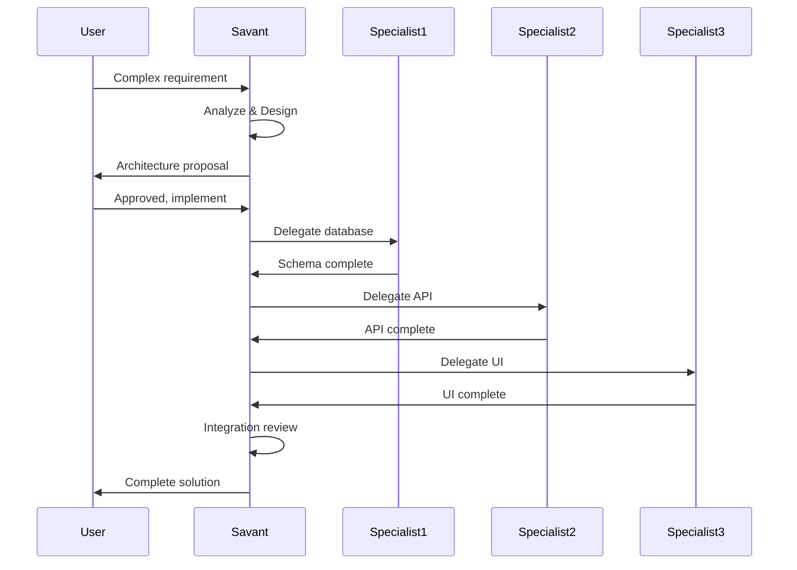

# Savant Agents

Savant agents are master orchestrators with broad, deep knowledge across entire technology ecosystems. They make architectural decisions, choose technologies, and coordinate specialist agents for complex implementations.

## What Makes a Savant?

Savants combine:

- **Breadth**: Knowledge across the entire ecosystem (frontend, backend, database, deployment)
- **Depth**: Deep understanding of each framework and tool
- **Decision-Making**: Technology selection and architectural patterns
- **Orchestration**: Coordinates multiple specialists
- **Best Practices**: Industry-standard patterns and recommendations

## When to Use Savants

Use savants when you need:

- **Architectural decisions** - Choosing between frameworks, patterns, and approaches
- **Technology selection** - Deciding on the tech stack for new projects
- **Complex problems** - Cross-cutting issues spanning multiple domains
- **Full-stack coordination** - Building features that touch database, API, and UI
- **High-level guidance** - Understanding tradeoffs and best practices
- **Integration planning** - How different pieces fit together

## Current Savants

### react-native-savant

**Name:** `react-native-savant`

**Description:** Master expert in React Native and mobile cross-platform development. Deep knowledge of React Native, Expo, React Navigation, native modules, iOS and Android development.

#### Core Expertise

**React Native Framework (0.73+):**

- Core Architecture (Fabric, Turbo Modules, JSI, Bridge)
- Components (FlatList, SectionList, Pressable, Modal)
- Hooks (useState, useEffect, useCallback, useMemo)
- Native Modules (Bridging, Turbo Modules, JSI)
- Performance (Hermes, FlatList optimization, bundle size)
- New Architecture (Fabric renderer, CodeGen)

**Expo Framework (SDK 50+):**

- Expo Router (File-based routing, layouts, deep linking)
- EAS Build (Cloud builds, development builds, preview builds)
- EAS Submit (App Store and Play Store automation)
- EAS Update (Over-the-air updates, channels, rollbacks)
- Expo Prebuild (Generate native projects, config plugins)
- Expo Modules API (Swift/Kotlin native modules)

**iOS Development:**

- Swift (async/await, Combine, SwiftUI interop)
- SwiftUI (Declarative UI, state management)
- UIKit (View controllers, Auto Layout)
- CocoaPods (Dependency management)
- Xcode (Build settings, code signing)
- App Store (TestFlight, App Store Connect)

**Android Development:**

- Kotlin (Coroutines, Flow, sealed classes)
- Jetpack Compose (Declarative UI)
- Gradle (Build configuration, variants)
- Android SDK (Activities, Fragments, Services)
- Play Store (Play Console, App Bundles)

**State Management:**

- Zustand, Redux Toolkit, Jotai, TanStack Query
- Context API, MobX

**Mobile-Specific:**

- Data Persistence (AsyncStorage, SQLite, Realm, WatermelonDB)
- Networking (Fetch, Axios, TanStack Query, GraphQL)
- Authentication (OAuth 2.0, biometrics, SecureStore, JWT)
- Animation (Reanimated, Gesture Handler, Lottie, Skia)
- Push Notifications (Expo Notifications, FCM, APNs)

**DevOps:**

- EAS Build/Submit/Update
- Fastlane, GitHub Actions
- Sentry, Firebase

#### Usage Examples

**Architecture Decision:**

```
Use react-native-savant to design a cross-platform social media app with offline-first architecture
```

**Technology Selection:**

```
Use react-native-savant to choose between Expo managed workflow and bare workflow for my e-commerce app
```

**Complex Problem:**

```
Use react-native-savant to optimize app performance and reduce bundle size from 50MB to under 20MB
```

**Full-Stack Integration:**

```
Use react-native-savant to integrate GraphQL API with React Native app using Apollo Client
```

**When to Delegate:**

After architectural decisions, the savant may delegate to:

- **frontend-ui** - Component design, accessibility
- **backend-api** - API integration, GraphQL queries
- **database** - SQLite schema, query optimization
- **security** - Authentication flows, secure storage
- **qa-tester** - E2E testing with Detox/Maestro
- **deployment** - EAS Build configuration, app store submission
- **performance** - Performance profiling, bundle analysis
- **monitoring** - Crash reporting, analytics setup

---

### flutter-savant

**Name:** `flutter-savant`

**Description:** Master expert in Flutter and Dart mobile development. Deep knowledge of Flutter SDK, Dart language, state management (BLoC, Riverpod, Provider), platform channels, iOS and Android development.

#### Core Expertise

**Flutter SDK (3.x+):**

- Framework Architecture (Widget tree, Element tree, RenderObject tree)
- Material Design 3 (Theming, dynamic color, adaptive layouts)
- Cupertino (iOS-style widgets)
- Widgets (StatelessWidget, StatefulWidget, InheritedWidget)
- Layout (Row, Column, Stack, Flex, Slivers)
- Advanced (CustomPaint, CustomScrollView, Hero animations)

**Dart Language (3.x+):**

- Null safety, sound type system
- Pattern matching, switch expressions
- Records, sealed classes
- Async/Await (Future, Stream, isolates)
- Extension methods, mixins, generics

**State Management:**

- BLoC (flutter_bloc, Cubit, BlocProvider)
- Riverpod (StateNotifier, FutureProvider, family, autoDispose)
- Provider (ChangeNotifier, MultiProvider)
- GetX, MobX, Redux

**Navigation:**

- go_router (Declarative routing, deep linking)
- Navigator 2.0 (RouterDelegate, declarative navigation)
- Navigator 1.0 (push, pop, MaterialPageRoute)

**Platform Channels:**

- MethodChannel, EventChannel
- FFI (Foreign Function Interface)
- Pigeon (Type-safe platform channels)
- Swift/Kotlin integration

**Firebase:**

- Authentication (Email, OAuth, phone auth)
- Cloud Firestore (Real-time database, queries)
- Cloud Functions, Cloud Storage
- Analytics, Crashlytics, Cloud Messaging
- Remote Config, Performance Monitoring

**Data Persistence:**

- Hive, Isar, sqflite, drift
- shared_preferences, secure_storage

**Mobile Platforms:**

- iOS (Swift, SwiftUI, UIKit, CocoaPods, Xcode, App Store)
- Android (Kotlin, Jetpack Compose, Gradle, Play Store)

**DevOps:**

- Fastlane, Codemagic, GitHub Actions
- Firebase App Distribution

**Testing:**

- Unit tests, widget tests, golden tests
- Integration tests, mockito

#### Usage Examples

**Architecture Decision:**

```
Use flutter-savant to design a Flutter e-commerce app with offline-first architecture and Firestore sync
```

**Technology Selection:**

```
Use flutter-savant to choose between BLoC and Riverpod for a large-scale enterprise application
```

**Complex Problem:**

```
Use flutter-savant to optimize Flutter app performance and reduce memory usage by 40%
```

**Full-Stack Integration:**

```
Use flutter-savant to integrate Firebase Authentication and Firestore with clean architecture pattern
```

**When to Delegate:**

After architectural decisions, the savant may delegate to:

- **frontend-ui** - Material Design 3 theming, advanced animations
- **backend-api** - API integration, GraphQL setup
- **database** - Firestore security rules, complex queries
- **security** - Authentication flows, encryption
- **qa-tester** - Widget testing, integration testing
- **deployment** - Fastlane setup, CI/CD pipelines
- **performance** - Performance profiling, optimization
- **monitoring** - Crashlytics setup, analytics

---

### fullstack-js-savant

**Name:** `fullstack-js-savant`

**Description:** Master expert in fullstack JavaScript/TypeScript development. Orchestrates entire application development from architecture to deployment.

#### Core Expertise

**Frontend Frameworks:**

- React 18+ (Hooks, Context, Server Components, Suspense)
- Next.js 15+ (App Router, Server Actions, Streaming)
- Vue 3 (Composition API, Nuxt 3)
- Angular 18+ (Signals, Standalone Components)
- Svelte/SvelteKit
- Solid.js

**Backend Frameworks:**

- Node.js (Event loop, streams, workers, clustering)
- Express.js (Middleware, routing, REST APIs)
- NestJS (Dependency injection, microservices, GraphQL)
- Fastify (High performance, schema validation)
- Hono (Edge-first framework)
- tRPC (End-to-end type safety)

**Database & ORM:**

- PostgreSQL (Advanced queries, indexing, partitioning)
- MongoDB (Aggregation pipeline, indexing)
- Redis (Caching strategies, pub/sub)
- Prisma (Schema design, migrations, query optimization)
- Drizzle (Type-safe ORM)
- TypeORM

**Real-time & Communication:**

- WebSockets (Socket.io, ws)
- Server-Sent Events
- GraphQL (Apollo Server, subscriptions)
- gRPC (Protocol buffers)

**Authentication & Security:**

- NextAuth.js v5 (OAuth, credentials, JWT)
- Passport.js
- Auth0, Clerk, Supabase Auth
- JWT, OAuth2, OIDC
- OWASP Top 10

**State Management:**

- React: useState, useReducer, Context, Zustand, Jotai, Redux Toolkit
- Vue: Pinia, Vuex
- TanStack Query (server state)

**Build Tools:**

- Vite, Turbopack, Webpack, esbuild, Rollup

**Testing:**

- Vitest, Jest, Playwright, Cypress, Testing Library

**DevOps:**

- Vercel, Netlify, Docker, Kubernetes
- GitHub Actions, GitLab CI
- Sentry, DataDog, OpenTelemetry

#### Usage Examples

**Architecture Decision:**

```bash
Use fullstack-js-savant to help me choose between Next.js App Router and Remix for my new SaaS application
```

**Complex Feature:**

```bash
Use fullstack-js-savant to design a real-time collaborative document editing system
```

**Technology Selection:**

```bash
Use fullstack-js-savant to recommend a tech stack for an e-commerce platform with 1M+ users
```

**Full-Stack Implementation:**

```bash
Use fullstack-js-savant to build a complete authentication system with email/password and OAuth
```

#### Expected Response Pattern

When you invoke the savant, expect:

1. **Requirement Analysis**
    - Understanding your needs
    - Identifying constraints
    - Clarifying requirements

2. **Architecture Proposal**
    - Technology stack recommendation
    - Architecture patterns
    - Justification for choices

3. **Implementation Plan**
    - Step-by-step breakdown
    - Which specialists to use
    - Integration points

4. **Code Examples**
    - Production-ready patterns
    - Best practices
    - Common pitfalls to avoid

5. **Delegation Strategy**
    - When to use specialists
    - How pieces integrate
    - Review checkpoints

#### Architecture Decision Framework

The savant uses this framework for decisions:

**Project Scale:**

- **Small (MVP, prototypes)**: Next.js + Vercel + Supabase
- **Medium (SaaS, B2B)**: Next.js + tRPC + Prisma + PostgreSQL
- **Large (Enterprise)**: Microservices with NestJS + Next.js frontend
- **Real-time**: Next.js + Socket.io + Redis

**Performance Requirements:**

- **High Performance**: Fastify, Hono, Solid.js
- **Standard**: Next.js, Express, React
- **SEO Critical**: Next.js App Router, Nuxt 3, Remix

**Team Expertise:**

- **TypeScript Strong**: tRPC, Prisma, Next.js
- **Traditional Backend**: Express + React
- **Full-Type Safety**: End-to-end TypeScript with tRPC

#### Example Interaction

**User Request:**
```bash
Use fullstack-js-savant to design a blog platform with comments, likes, and user authentication
```

**Savant Response:**

```markdown
## Blog Platform Architecture

### Technology Stack Recommendation

**Frontend:** Next.js 15 with App Router
- Server Components for blog posts (SEO)
- Client Components for interactive features
- Streaming for better UX

**Backend:** tRPC for type-safe APIs
- End-to-end type safety
- Excellent DX with TypeScript
- Built-in validation with Zod

**Database:** PostgreSQL with Prisma
- Relational data (posts, comments, users)
- ACID transactions
- Full-text search capability

**Authentication:** NextAuth.js v5
- Email/password provider
- OAuth providers (GitHub, Google)
- Session management
- Protected routes

### Database Schema

```prisma
model User {
  id        String    @id @default(cuid())
  email     String    @unique
  name      String
  posts     Post[]
  comments  Comment[]
  likes     Like[]
}

model Post {
  id        String    @id @default(cuid())
  title     String
  slug      String    @unique
  content   String    @db.Text
  published Boolean   @default(false)
  authorId  String
  author    User      @relation(fields: [authorId], references: [id])
  comments  Comment[]
  likes     Like[]
  createdAt DateTime  @default(now())
}

model Comment {
  id        String   @id @default(cuid())
  content   String
  postId    String
  post      Post     @relation(fields: [postId], references: [id])
  authorId  String
  author    User     @relation(fields: [authorId], references: [id])
  createdAt DateTime @default(now())
}

model Like {
  id        String   @id @default(cuid())
  postId    String
  post      Post     @relation(fields: [postId], references: [id])
  userId    String
  user      User     @relation(fields: [userId], references: [id])
  createdAt DateTime @default(now())

  @@unique([postId, userId])
}
```

### Implementation Plan

1. **Database Setup** (Delegate to `database` specialist)
   - Create Prisma schema
   - Set up migrations
   - Add indexes for performance

2. **Authentication** (Delegate to `backend-api` specialist)
   - Configure NextAuth.js
   - Set up OAuth providers
   - Implement protected routes

3. **Blog API** (Delegate to `backend-api` specialist)
   - Create tRPC router for posts
   - Add CRUD operations
   - Implement comments and likes

4. **UI Components** (Delegate to `frontend-ui` specialist)
   - Blog post list with shadcn/ui
   - Post detail page
   - Comment section
   - Create post form

5. **Integration & Testing** (Use `qa-tester` specialist)
   - E2E tests with Playwright
   - Unit tests for API

### Next Steps

1. Use database specialist to create the schema
2. Use backend-api to implement authentication
3. Use fullstack-nextjs to build the blog pages
4. Use frontend-ui to create interactive components
5. Use code-reviewer to review implementation
```

---

### java-spring-savant

**Name:** `java-spring-savant`

**Description:** Master expert in Spring ecosystem and enterprise Java development.

#### Core Expertise

**Spring Framework:**

- Spring Boot 3.x (Auto-configuration, starters)
- Spring Security (Authentication, authorization)
- Spring Data JPA (Repositories, queries)
- Spring Web (REST APIs, MVC)
- Spring Cloud (Microservices patterns)

**Database:**

- PostgreSQL, MySQL, Oracle
- JPA, Hibernate
- Query optimization
- Transaction management

**Architecture Patterns:**

- Microservices
- Event-driven architecture
- Domain-driven design
- Clean architecture

**Security:**

- OAuth2, JWT
- Spring Security
- RBAC, ABAC
- API security

**Testing:**

- JUnit 5, Mockito
- TestContainers
- Integration testing
- Performance testing

#### Usage Examples

**Microservices Architecture:**

```bash
Use java-spring-savant to design a microservices architecture for an enterprise application
```

**Spring Security:**

```bash
Use java-spring-savant to implement OAuth2 authentication with Spring Security
```

**API Design:**

```bash
Use java-spring-savant to design RESTful APIs following Spring best practices
```

## Savant Workflow

When you invoke a savant:



## Best Practices

### 1. Provide Context

Give savants enough information to make informed decisions:

```bash
# Good
Use fullstack-js-savant to design a SaaS platform for project management.
Expected scale: 10,000 users, real-time updates needed, team of 5 developers.

# Not enough context
Use fullstack-js-savant to build an app
```

### 2. Ask for Tradeoffs

Savants excel at explaining tradeoffs:

```bash
Use fullstack-js-savant to compare Next.js App Router vs Remix for my use case
```

### 3. Leverage Orchestration

Let savants coordinate specialists:

```bash
Use fullstack-js-savant to build a complete blog feature
# Savant will orchestrate database, backend-api, frontend-ui
```

### 4. Request Architecture Reviews

Use savants to review existing architecture:

```bash
Use fullstack-js-savant to review my current architecture and suggest improvements
```

## Savant vs Specialist

### Use Savant When:

- Making architectural decisions
- Choosing technologies
- Need cross-cutting guidance
- Building complex features
- Want orchestration

### Use Specialist When:

- Implementing specific features
- Deep domain expertise needed
- Know what technology to use
- Quick, focused tasks

## Future Savants

The architecture supports additional savants:

- **python-django-savant** - Python/Django ecosystem
- **golang-savant** - Go ecosystem
- **dotnet-savant** - .NET/C# ecosystem
- **mobile-savant** - React Native/Flutter
- **typescript-fullstack-savant** - Pure TypeScript focus

## Summary

Savants provide:

- **Breadth**: Knowledge across entire ecosystem
- **Depth**: Deep understanding of each tool
- **Orchestration**: Coordinates specialists
- **Best Practices**: Industry standards
- **Decision-Making**: Technology selection

## Next Steps

- [View JavaScript specialists](javascript-specialists.md)
- [View cross-cutting specialists](cross-cutting-specialists.md)
- [Learn workflow commands](../architecture/workflow-commands.md)
- [See workflow examples](../guides/workflows.md)
