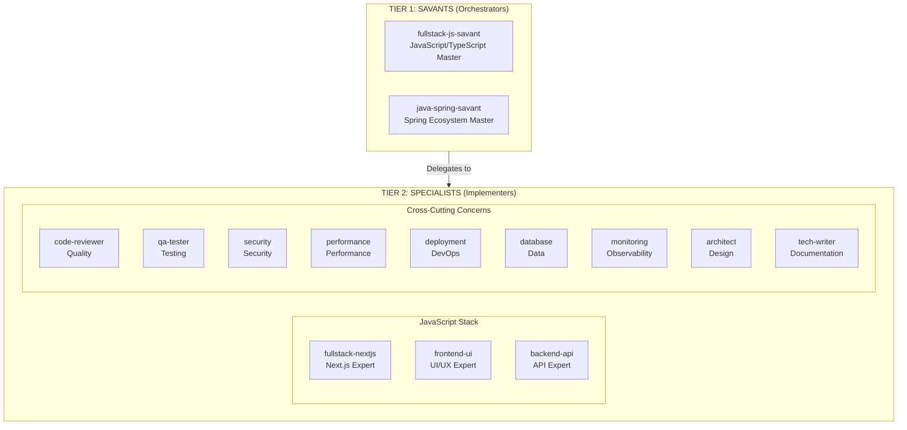
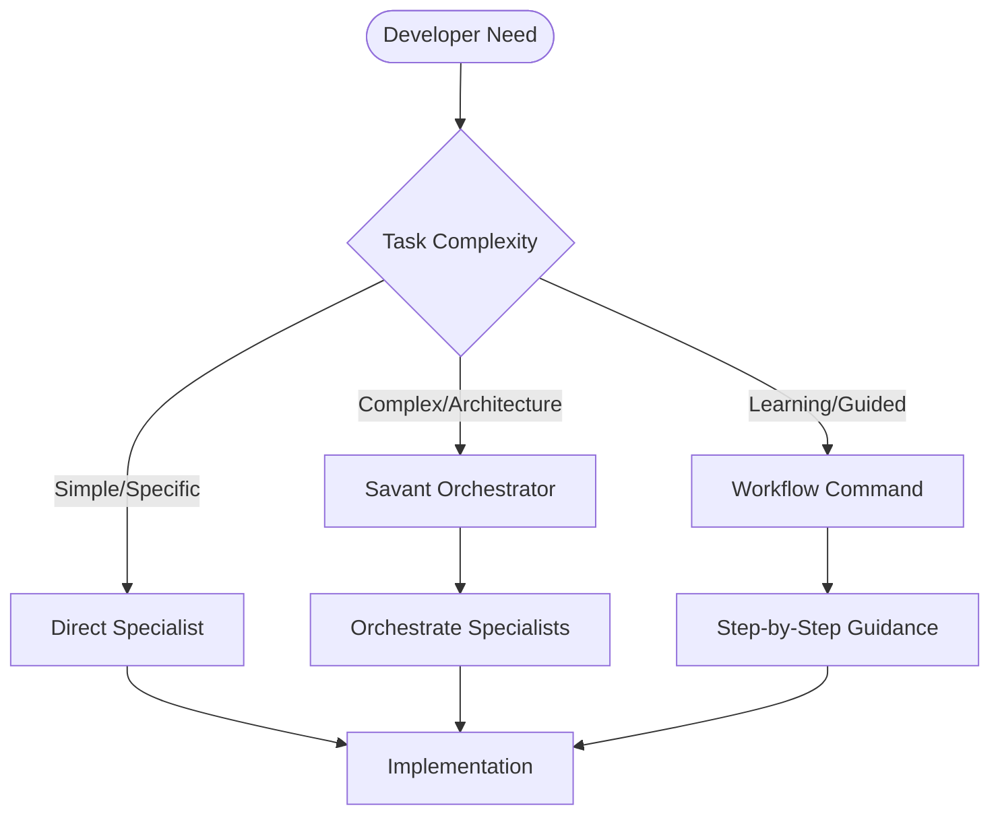
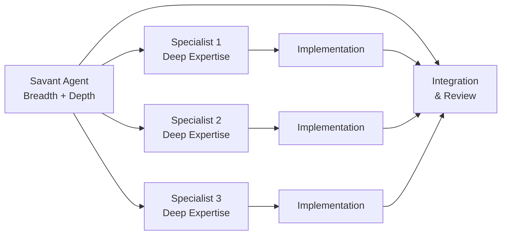
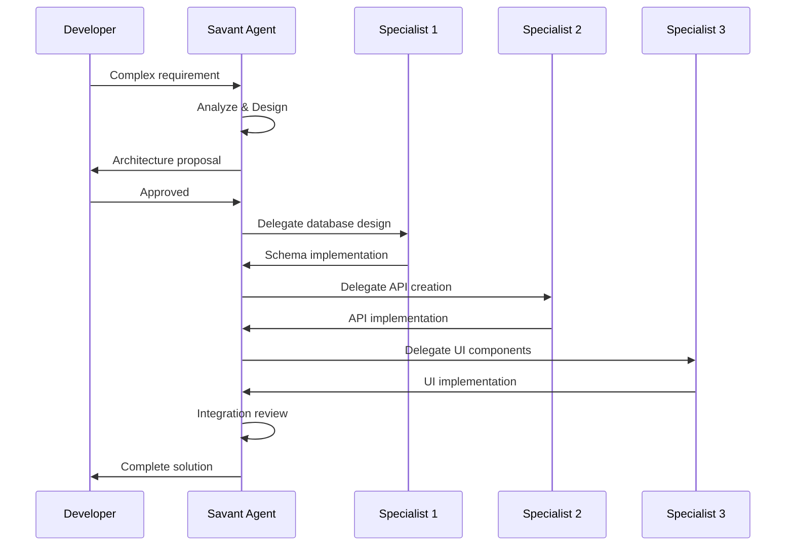
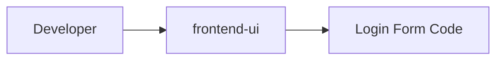
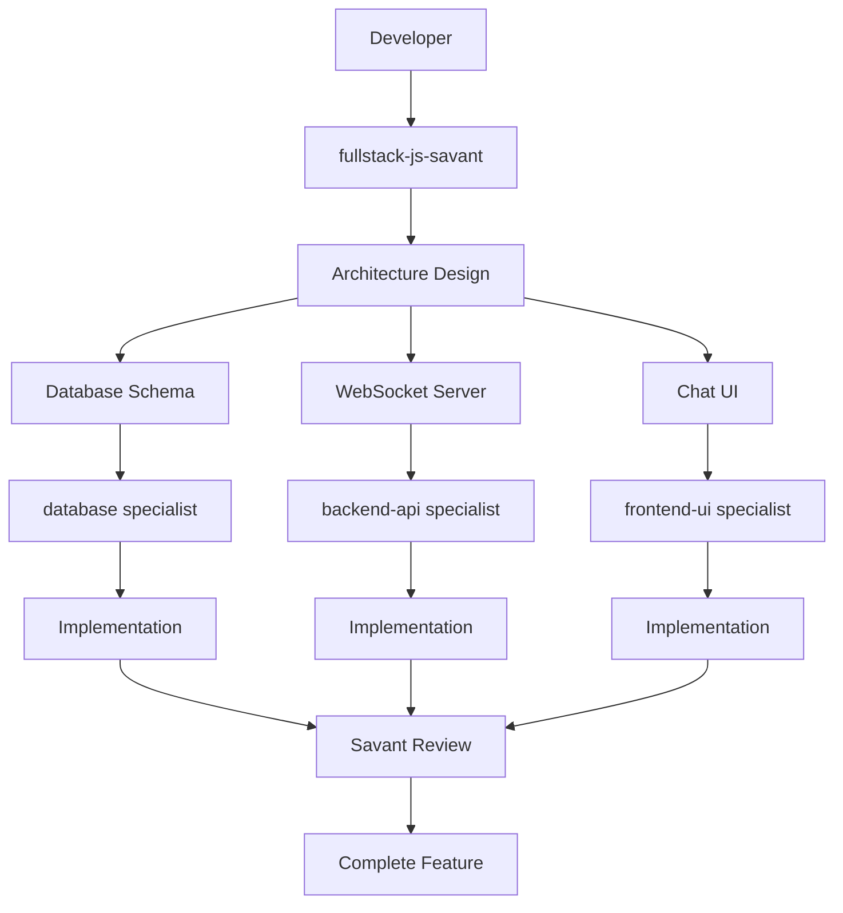
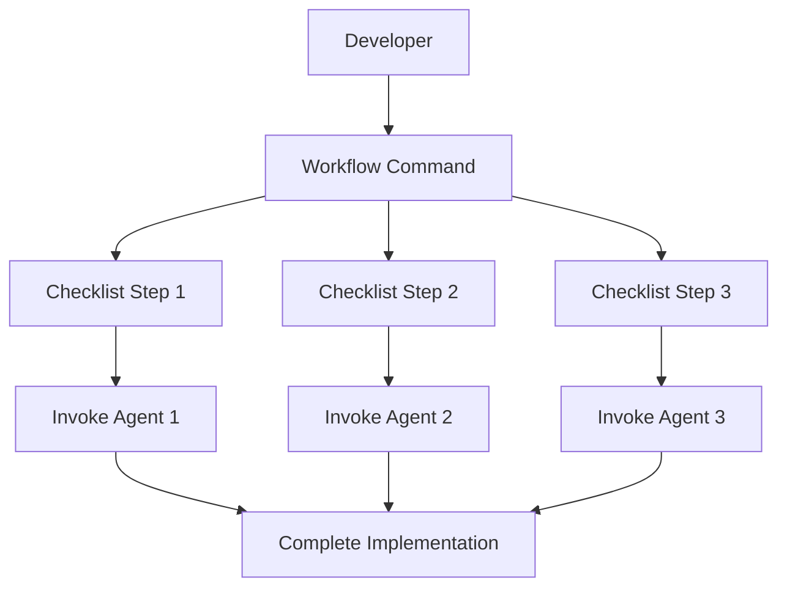
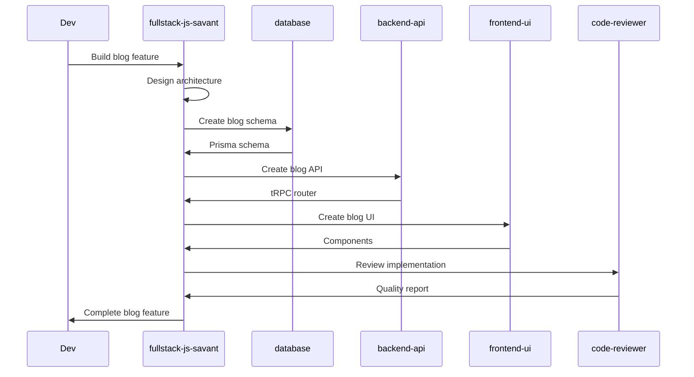

# Architecture Overview

MCP Sub-Agents implements a two-tier agent architecture designed to provide both breadth and depth of expertise across technology stacks.

## Two-Tier Architecture



## Architecture Principles

### 1. Separation of Concerns

**Tier 1: Savants**

- Broad knowledge across entire ecosystems
- Architectural decision making
- Technology selection and comparison
- Cross-cutting integration
- Orchestration of specialists

**Tier 2: Specialists**

- Deep expertise in specific domains
- Implementation details
- Framework-specific patterns
- Detailed code generation
- Domain-specific optimization

### 2. Flexible Invocation

The architecture supports multiple usage patterns:



### 3. Knowledge Hierarchy



## Tier 1: Savants

### What is a Savant?

A savant is a master expert with comprehensive knowledge across an entire technology ecosystem. Savants make architectural decisions, choose technologies, and orchestrate specialist agents.

### Savant Characteristics

- **Breadth**: Knowledge of entire ecosystem (frontend, backend, database, deployment)
- **Depth**: Deep understanding of each framework and tool
- **Decision-Making**: Technology selection and architectural patterns
- **Orchestration**: Coordinates multiple specialists for complex tasks
- **Best Practices**: Industry-standard patterns and recommendations

### Current Savants

#### fullstack-js-savant

Master of JavaScript/TypeScript ecosystem:

- Frontend: React, Next.js, Vue, Angular, Svelte
- Backend: Node.js, Express, NestJS, Fastify
- Database: PostgreSQL, MongoDB, Redis with ORMs
- Real-time: WebSockets, Server-Sent Events
- Authentication: NextAuth.js, Passport.js, OAuth
- State Management: Redux, Zustand, TanStack Query
- Build Tools: Vite, Webpack, Turbopack
- Testing: Vitest, Playwright, Jest
- Deployment: Vercel, Docker, Kubernetes

**When to use:**

- Designing fullstack JavaScript applications
- Choosing between frontend frameworks
- Selecting authentication strategies
- Planning real-time features
- Making database decisions
- Architecting complex features

#### java-spring-savant

Master of Spring ecosystem:

- Spring Boot, Spring Security, Spring Data
- JPA, Hibernate, database integration
- Microservices architecture
- REST and GraphQL APIs
- Testing with JUnit and Mockito
- Cloud deployment and containerization

**When to use:**

- Designing Spring-based applications
- Enterprise Java architecture
- Microservices planning
- Spring Security implementation

### Savant Workflow



## Tier 2: Specialists

### What is a Specialist?

A specialist is a deep domain expert focusing on a specific framework, tool, or practice. Specialists handle detailed implementation and optimization.

### Specialist Categories

#### 1. Stack-Specific Specialists

Experts in particular technology stacks:

**JavaScript/TypeScript Specialists:**

- **fullstack-nextjs** - Next.js 15+ with App Router
- **frontend-ui** - shadcn/ui and Tailwind CSS
- **backend-api** - tRPC and NextAuth.js

**Java Specialists (Future):**

- spring-boot
- spring-security
- spring-data-jpa

#### 2. Cross-Cutting Specialists

Experts that work across all stacks:

- **code-reviewer** - Code quality and best practices
- **qa-tester** - Testing strategies and implementation
- **security** - Security audits and OWASP compliance
- **performance** - Optimization and Core Web Vitals
- **deployment** - CI/CD and infrastructure
- **database** - Schema design and query optimization
- **monitoring** - Observability and error tracking
- **architect** - System design and scalability
- **tech-writer** - Technical documentation

### Specialist Characteristics

- **Deep Focus**: Expert in one specific domain
- **Implementation Details**: Production-ready code
- **Best Practices**: Domain-specific patterns
- **Optimization**: Performance and efficiency
- **Testing**: Domain-specific test strategies

## Usage Patterns

### Pattern 1: Simple Implementation

For straightforward tasks, use specialists directly:

```bash
Use frontend-ui to create a login form with shadcn/ui
```

**Flow:**



### Pattern 2: Complex Feature

For complex features, use savant orchestration:

```bash
Use fullstack-js-savant to build a real-time chat feature
```

**Flow:**



### Pattern 3: Workflow-Guided

For learning or ensuring best practices:

```bash
/mcp-implement-fullstack
```

**Flow:**



### Pattern 4: Multi-Phase Development

For complete feature development:

```bash
# Phase 1: Design
/mcp-design-nextjs

# Phase 2: Implementation
/mcp-implement-fullstack

# Phase 3: Review
/mcp-review-code
/mcp-review-security

# Phase 4: QA
/mcp-qa-e2e

# Phase 5: Deploy
/mcp-deploy
```

## Decision Matrix

### When to Use Savants

Use savants when you need:

- Architecture decisions
- Technology selection
- Complex cross-cutting problems
- Full-stack feature coordination
- High-level technical guidance
- Integration planning
- Tradeoff analysis

### When to Use Specialists

Use specialists when you need:

- Framework-specific implementation
- UI component development
- API endpoint creation
- Database schema design
- Security audits
- Performance optimization
- Detailed code generation
- Domain-specific best practices

### When to Use Workflow Commands

Use workflow commands when you need:

- Step-by-step guidance
- Learning new patterns
- Ensuring completeness
- Following best practices
- Structured development
- Comprehensive checklists

## Agent Communication

### How Savants Delegate

When a savant encounters a task requiring deep expertise:

```typescript
// Conceptual delegation pattern
class SavantAgent {
  async handleRequest(requirement: string) {
    // 1. Analyze requirement
    const analysis = this.analyzeRequirement(requirement)

    // 2. Design architecture
    const architecture = this.designArchitecture(analysis)

    // 3. Identify required specialists
    const specialists = this.identifySpecialists(architecture)

    // 4. Delegate to specialists
    const implementations = await Promise.all(
      specialists.map(spec => spec.implement(architecture))
    )

    // 5. Review integration
    const integration = this.reviewIntegration(implementations)

    // 6. Return complete solution
    return {
      architecture,
      implementations,
      integration,
      recommendations: this.getRecommendations()
    }
  }
}
```

### Agent Collaboration Example

Building a blog feature:



## Extensibility

### Adding New Savants

The architecture supports additional savants for other ecosystems:

- **python-django-savant** - Python/Django ecosystem
- **golang-savant** - Go ecosystem
- **dotnet-savant** - .NET/C# ecosystem
- **mobile-savant** - React Native/Flutter

### Adding New Specialists

New specialists can be added for:

- Specific frameworks (e.g., remix-fullstack, vue-nuxt)
- Additional tools (e.g., graphql-api, redis-cache)
- Emerging patterns (e.g., edge-computing, web3)

## Best Practices

### 1. Start with Architecture

For complex features, always start with architecture:

```bash
# Good
Use fullstack-js-savant to design the feature
# Then implement with specialists

# Not ideal
Use frontend-ui to build components
# Without architecture planning
```

### 2. Use the Right Level

Match complexity with agent tier:

```bash
# Simple task - use specialist
Use frontend-ui to create a button component

# Complex task - use savant
Use fullstack-js-savant to design a multi-tenant SaaS architecture
```

### 3. Leverage Workflow Commands

For standardized processes:

```bash
# Instead of manual steps
/mcp-review-security  # Comprehensive security audit

# Instead of
Use security to check for XSS
Use security to check for SQL injection
Use security to check for...
```

### 4. Review and Iterate

Always review implementations:

```bash
# After implementation
Use code-reviewer to review the implementation

# Address issues
Use [relevant-specialist] to fix identified issues

# Re-review
Use code-reviewer to verify fixes
```

## Summary

The two-tier architecture provides:

- **Flexibility**: Choose the right tool for the task
- **Expertise**: Deep knowledge at both breadth and depth
- **Efficiency**: Direct access or guided workflows
- **Quality**: Built-in review and best practices
- **Scalability**: Extensible for new technologies

## Next Steps

- [Learn about workflow commands](workflow-commands.md)
- [Explore savant agents](../agents/savants.md)
- [View specialist agents](../agents/javascript-specialists.md)
- [See workflow examples](../guides/workflows.md)
