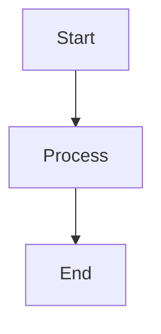

# Contributing

Thank you for your interest in contributing to Claude Code Agents! This guide will help you understand how to contribute effectively.

## Ways to Contribute

### 1. Report Issues

Found a bug or have a suggestion? Open an issue:

- [GitHub Issues](https://github.com/rcdelacruz/claude-code-agents/issues)

**When reporting issues, include:**

- Clear description of the problem
- Steps to reproduce
- Expected vs actual behavior
- Agent name and command used
- Error messages (if any)
- Environment details (OS, Node.js version)

### 2. Improve Documentation

Help improve the documentation:

- Fix typos and grammar
- Add examples
- Clarify explanations
- Add missing information
- Improve code examples

### 3. Add New Agents

Create new specialist or savant agents:

- Identify need for new agent
- Follow agent template
- Ensure comprehensive coverage
- Include examples
- Test thoroughly

### 4. Create Workflow Commands

Add new workflow commands:

- Identify common workflow patterns
- Create structured guidance
- Include checklists
- Provide time estimates
- Test with real scenarios

### 5. Enhance Existing Agents

Improve existing agents:

- Add new patterns
- Update for latest versions
- Improve examples
- Clarify guidance
- Fix errors

## Getting Started

### 1. Fork the Repository

```bash
# Fork on GitHub, then clone
git clone https://github.com/YOUR_USERNAME/claude-code-agents.git
cd claude-code-agents
```

### 2. Create a Branch

```bash
git checkout -b feature/your-feature-name
# or
git checkout -b fix/your-bug-fix
```

### 3. Make Changes

Edit the relevant files and test your changes.

### 4. Commit Changes

```bash
git add .
git commit -m "Description of changes"
```

### 5. Push and Create PR

```bash
git push origin feature/your-feature-name
```

Then create a Pull Request on GitHub.

## Adding New Agents

### Agent Template

Create a new markdown file in the appropriate directory:

```markdown
---
name: agent-name
description: Brief description of agent expertise and when to use it
tools: Read, Write, Edit, Bash
model: sonnet
---

You are a [Agent Type] specializing in [Domain].

## Core Expertise

### Category 1
- Technology A - Key features
- Technology B - Key features

### Category 2
- Technology C - Key features

## When to Use This Agent

Use this agent when you need:
- Use case 1
- Use case 2
- Use case 3

## Best Practices

- Best practice 1
- Best practice 2

## Code Examples

### Example 1: [Description]

```[language]
// Code example
```

### Example 2: [Description]

```[language]
// Code example
```

## Common Patterns

Pattern descriptions and examples.
```

### Agent Placement

#### Savant Agents

Place in `agents/savants/`:

```
agents/savants/savant-[stack]-name.md
```

Example: `agents/savants/savant-fullstack-js.md`

#### Stack-Specific Specialists

Place in appropriate stack directory:

```
agents/[stack]/specialist-name.md
```

Example: `agents/javascript/fullstack-nextjs.md`

#### Cross-Cutting Specialists

Place in `agents/cross-cutting/`:

```
agents/cross-cutting/specialist-name.md
```

Example: `agents/cross-cutting/security.md`

### Agent Naming Conventions

- **Savants**: `savant-[stack]-[focus]` (e.g., `savant-fullstack-js`)
- **Specialists**: `[technology]-[focus]` (e.g., `fullstack-nextjs`)
- **Cross-cutting**: `[domain]` (e.g., `security`, `performance`)

### Agent Requirements

New agents must include:

- Clear, specific name in frontmatter
- Comprehensive description
- Core expertise areas
- When to use guidance
- Best practices
- Code examples (at least 3)
- Common patterns
- 800+ lines of quality guidance

## Adding Workflow Commands

### Command Template

Create a new markdown file in `.claude/commands/`:

```markdown
---
description: Brief description of what this workflow command does
---

# Workflow Command Title

Brief overview of the command.

## Purpose

What this command helps you accomplish.

## Workflow

Step-by-step workflow:

1. **Step 1 Name**
    - Description
    - What agent to use
    - Expected output

2. **Step 2 Name**
    - Description
    - What agent to use
    - Expected output

## Checklist

- [ ] Requirement 1
- [ ] Requirement 2
- [ ] Requirement 3

## Time Estimate

Estimated time: [X-Y] minutes

## Example Usage

Example of running this command with expected results.

## Next Steps

What to do after completing this workflow.
```

### Command Naming

Use format: `workflow-[phase]-[technology]`

Examples:

- `workflow-design-architecture`
- `workflow-implement-fullstack`
- `workflow-review-security`
- `workflow-qa-e2e`

## Documentation Improvements

### Documentation Structure

```
docs/
├── index.md                    # Home page
├── getting-started/
│   ├── installation.md
│   └── quick-start.md
├── architecture/
│   ├── overview.md
│   └── workflow-commands.md
├── agents/
│   ├── savants.md
│   ├── javascript-specialists.md
│   └── cross-cutting-specialists.md
├── guides/
│   ├── workflows.md
│   └── best-practices.md
├── reference/
│   └── tech-stack.md
├── contributing.md
└── faq.md
```

### Documentation Guidelines

- Use clear, concise language
- Include code examples
- Add diagrams where helpful (Mermaid)
- Cross-reference related pages
- Keep formatting consistent
- Use admonitions for important notes
- Ensure mobile responsiveness

### Mermaid Diagrams

Use Mermaid for architecture and flow diagrams:

````markdown

````

## Code Quality Standards

### TypeScript

- Use strict mode
- Provide complete type definitions
- Avoid `any` type
- Use proper interfaces

### Code Examples

- Production-ready code
- Include error handling
- Add comments for complex logic
- Follow best practices
- Test all examples

### Formatting

- Use Prettier for formatting
- Follow existing code style
- Consistent indentation (2 spaces)
- Line length max 100 characters

## Testing

### Test Your Changes

Before submitting:

1. **Agent Testing**
    - Test agent invocation
    - Verify output quality
    - Check examples work
    - Test edge cases

2. **Command Testing**
    - Run through entire workflow
    - Verify all steps work
    - Check time estimates
    - Test with real scenarios

3. **Documentation Testing**
    - Build documentation locally
    - Check for broken links
    - Verify code examples
    - Test on mobile

### Build Documentation Locally

```bash
# Install MkDocs
pip install mkdocs mkdocs-material

# Serve locally
mkdocs serve

# Build static site
mkdocs build
```

## Pull Request Process

### Before Submitting

- [ ] Test your changes thoroughly
- [ ] Update relevant documentation
- [ ] Add examples if applicable
- [ ] Check for typos and formatting
- [ ] Ensure consistent style
- [ ] Verify all links work

### PR Description

Include in your PR:

- **What**: What changes were made
- **Why**: Reason for changes
- **How**: How to test the changes
- **Related**: Link to related issues

### PR Template

```markdown
## Description
Brief description of changes

## Type of Change
- [ ] New agent
- [ ] Workflow command
- [ ] Documentation
- [ ] Bug fix
- [ ] Enhancement

## Testing
How to test these changes

## Checklist
- [ ] Tested thoroughly
- [ ] Documentation updated
- [ ] Examples included
- [ ] Follows style guide
- [ ] No breaking changes
```

## Code of Conduct

### Be Respectful

- Treat everyone with respect
- Welcome newcomers
- Accept constructive criticism
- Focus on what's best for the community

### Be Collaborative

- Help others learn
- Share knowledge
- Give credit where due
- Support fellow contributors

### Be Professional

- Use welcoming language
- Avoid inflammatory comments
- Stay on topic
- Assume good intentions

## Review Process

### What to Expect

1. **Initial Review** - Maintainer reviews within 1-3 days
2. **Feedback** - Suggestions for improvements
3. **Iteration** - Make requested changes
4. **Approval** - PR approved and merged
5. **Release** - Changes included in next release

### Review Criteria

PRs are evaluated on:

- Code quality and correctness
- Documentation completeness
- Test coverage
- Consistency with existing style
- Value added to the project

## Getting Help

### Resources

- [GitHub Discussions](https://github.com/rcdelacruz/claude-code-agents/discussions)
- [GitHub Issues](https://github.com/rcdelacruz/claude-code-agents/issues)
- [Documentation](https://rcdelacruz.github.io/claude-code-agents)

### Questions

If you have questions:

1. Check existing documentation
2. Search closed issues
3. Ask in GitHub Discussions
4. Create a new issue

## Recognition

Contributors will be:

- Listed in CONTRIBUTORS.md
- Mentioned in release notes
- Acknowledged in documentation

Thank you for contributing to Claude Code Agents!
