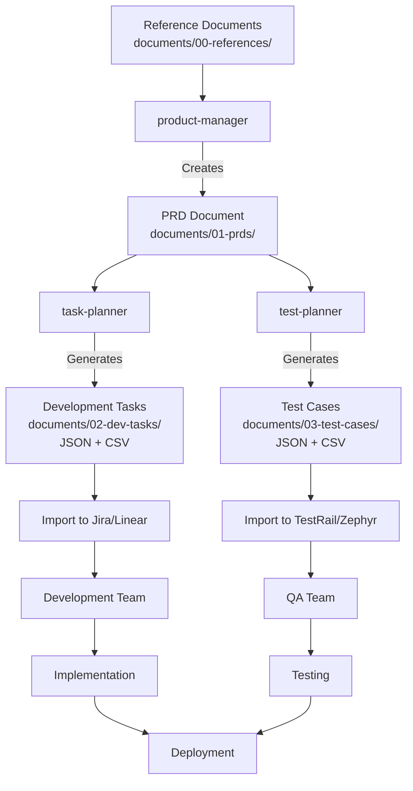

# Requirements to Implementation Workflow

This guide walks you through the complete workflow from gathering requirements to generating implementation artifacts using the MCP Sub-Agents system.

## Workflow Overview



## Step-by-Step Process

### Step 0: Add Reference Documents (Optional)

**Purpose**: Store input documents that will inform PRD creation

**Location**: `documents/00-references/`

**Documents to Include**:

- Business Requirements Documents (BRDs)
- User research findings
- Technical specifications
- Design documents and wireframes
- Compliance requirements

**Organization**:

```bash
documents/00-references/
├── brds/              # Business Requirements Documents
├── tech-specs/        # Technical specifications
├── user-research/     # User research, interviews, surveys
├── designs/           # UI/UX designs, wireframes, mockups
└── compliance/        # Legal, security, compliance docs
```

See the [Document Organization guide](document-organization.md#reference-documents) for details.

### Step 1: Create Product Requirements Document (PRD)

**Agent**: `product-manager`

**Input**:

- Reference documents from `documents/00-references/` (optional)
- Or direct feature description

**Command**:

```bash
Use product-manager to create a PRD for user authentication feature

Input documents (optional):
- BRD: documents/00-references/brds/auth-brd.md
- User research: documents/00-references/user-research/auth-interviews.pdf
- Tech specs: documents/00-references/tech-specs/current-auth-system.md
```

Or provide context directly:

```bash
Use product-manager to create a PRD for user authentication.

Context:
- Users can register with email/password
- Users can login with credentials
- Password must be 8+ characters
- JWT token for authentication
- Email verification required
```

**Output**:

- File: `documents/01-prds/user-authentication-prd.md`
- Format: Markdown
- Structure: 5-section PRD (Objective, Features, UX Flow, Technical Context, Open Questions)

### Step 2: Generate Development Tasks

**Agent**: `task-planner`

**Input**:

- PRD file from Step 1
- Team structure (optional)
- Tech stack (optional)
- Timeline (optional)

**Command**:

```bash
Use task-planner to generate development tasks from documents/01-prds/user-authentication-prd.md
```

With team context:

```bash
Use task-planner to generate tasks from documents/01-prds/user-authentication-prd.md

Team: 2 Backend (Node.js), 2 Frontend (React), 1 QA, 1 DevOps
Tech stack: Next.js 15, tRPC, Prisma, PostgreSQL
```

**Output**:

- JSON: `documents/02-dev-tasks/user-authentication-tasks.json`
- CSV: `documents/02-dev-tasks/user-authentication-tasks.csv`

**Task Fields**:

- `task_id`: TASK-001, TASK-002, etc.
- `title`: Brief action-oriented summary
- `description`: Detailed explanation with technical specifics
- `priority`: High, Medium, Low
- `effort`: Estimated hours (1-40)
- `role`: Frontend, Backend, Fullstack, QA, DevOps, Mobile, Security
- `dependencies`: Comma-separated task IDs or "None"

### Step 3: Generate Test Cases

**Agent**: `test-planner`

**Input**:

- PRD file from Step 1
- Focus areas (optional)

**Command**:

```bash
Use test-planner to generate test cases from documents/01-prds/user-authentication-prd.md
```

With focus areas:

```bash
Use test-planner to generate test cases from documents/01-prds/user-authentication-prd.md

Focus on:
- Security testing (SQL injection, XSS, authentication)
- Performance testing (load times, concurrent users)
- Integration testing (database, email service)
```

**Output**:

- JSON: `documents/03-test-cases/user-authentication-tests.json`
- CSV: `documents/03-test-cases/user-authentication-tests.csv`

**Test Case Fields**:

- `test_id`: TEST-001, TEST-002, etc.
- `scenario`: Clear description of what is being tested
- `steps`: Numbered step-by-step instructions
- `expected`: Specific, measurable expected behavior
- `priority`: High, Medium, Low
- `type`: Functional, Integration, E2E, Performance, Security, Usability, Boundary, Negative
- `prerequisites`: Conditions required or "None"

### Step 4: Import into Project Tools

#### Import Tasks

**Jira (JSON via API)**:

```bash
curl -X POST https://your-domain.atlassian.net/rest/api/3/issue/bulk \
  -H "Content-Type: application/json" \
  -d @documents/02-dev-tasks/user-authentication-tasks.json
```

**Jira (CSV via UI)**:

1. Projects → Your Project → "..." → Import
2. Select CSV file
3. Map columns to Jira fields

**Linear (CSV)**:

1. Linear → Import
2. Select CSV file
3. Map columns and import

**GitHub Issues (CLI)**:

```bash
cat documents/02-dev-tasks/user-authentication-tasks.json | \
  jq -r '.[] | "gh issue create --title \"\\(.title)\" --body \"\\(.description)\""' | bash
```

#### Import Test Cases

**TestRail (CSV)**:

1. TestRail → Test Cases → Import → Import from CSV
2. Select CSV file
3. Map columns to TestRail fields
4. Import

**TestRail (JSON via API)**:

```bash
curl -X POST https://your-domain.testrail.io/index.php?/api/v2/add_cases/1 \
  -H "Content-Type: application/json" \
  -d @documents/03-test-cases/user-authentication-tests.json
```

**Zephyr (CSV)**:

1. Zephyr → Test Repository → Import
2. Select CSV file
3. Map columns and import

**qTest (CSV)**:

1. qTest → Test Design → Import → Import Test Cases
2. Select CSV file
3. Map columns and import

### Step 5: Execute Implementation

1. **Development Team**:
   - Review tasks in Jira/Linear
   - Implement features according to task descriptions
   - Follow dependency chains
   - Track progress in project tool

2. **QA Team**:
   - Review test cases in TestRail/Zephyr
   - Execute manual tests following test steps
   - Automate tests using test specifications
   - Report results and defects

## File Formats

### JSON Format

**Advantages**:

- Programmable (API import)
- Type-safe
- Machine-readable
- Structured data

**Use for**:

- Jira API import
- Linear API import
- GitHub Issues API import
- TestRail API import
- Custom automation scripts

### CSV Format

**Advantages**:

- Human-readable
- Excel/Google Sheets compatible
- Easy manual editing
- Universal import support

**Use for**:

- Manual import into project tools
- Excel/Sheets viewing and editing
- Quick review and adjustments
- Sharing with non-technical stakeholders

## Complete Example: User Authentication Feature

### Step 0: Gather Reference Documents

```bash
# Copy reference documents to 00-references
cp ~/Downloads/auth-brd.pdf documents/00-references/brds/
cp ~/Downloads/security-requirements.pdf documents/00-references/compliance/
cp ~/Downloads/user-research.pdf documents/00-references/user-research/
```

### Step 1: Create PRD

```bash
Use product-manager to create a PRD for user authentication feature.

Input documents:
- BRD: documents/00-references/brds/auth-brd.pdf
- Security requirements: documents/00-references/compliance/security-requirements.pdf
- User research: documents/00-references/user-research/user-research.pdf

Context:
- Users can register with email/password
- Users can login and receive JWT token
- Password must be 8+ characters with special char requirement
- Email verification required before first login
- Password reset via email link
- Session timeout after 24 hours
- OAuth support for Google and GitHub

Tech stack: Next.js 15, NextAuth.js v5, Prisma, PostgreSQL
```

**Output**: `documents/01-prds/user-authentication-prd.md`

### Step 2: Generate Development Tasks

```bash
Use task-planner to generate development tasks from documents/01-prds/user-authentication-prd.md

Team structure:
- 2 Backend developers (Node.js/TypeScript)
- 2 Frontend developers (React/Next.js)
- 1 QA engineer
- 1 DevOps engineer

Timeline: 3 weeks (120 hours total)
```

**Output**:

- `documents/02-dev-tasks/user-authentication-tasks.json` (30-40 tasks)
- `documents/02-dev-tasks/user-authentication-tasks.csv`

**Sample Tasks**:

- TASK-001: Setup NextAuth.js configuration (4 hours, Backend, High)
- TASK-002: Create Prisma user schema with email/password fields (3 hours, Backend, High)
- TASK-003: Implement registration API endpoint (8 hours, Backend, High)
- TASK-004: Create email verification service (6 hours, Backend, High)
- TASK-005: Build registration form UI (6 hours, Frontend, High)
- TASK-006: Implement OAuth providers (Google, GitHub) (12 hours, Backend, Medium)

### Step 3: Generate Test Cases

```bash
Use test-planner to generate test cases from documents/01-prds/user-authentication-prd.md

Focus areas:
- Security testing (authentication, authorization, password hashing)
- Functional testing (registration, login, logout flows)
- Integration testing (email service, OAuth providers)
- Performance testing (load times, concurrent users)
```

**Output**:

- `documents/03-test-cases/user-authentication-tests.json` (50-70 test cases)
- `documents/03-test-cases/user-authentication-tests.csv`

**Sample Test Cases**:

- TEST-001: User successfully registers with valid email and password (Functional, High)
- TEST-002: Registration fails with invalid email format (Negative, High)
- TEST-003: Registration fails with weak password (Boundary, High)
- TEST-004: User successfully logs in with valid credentials (Functional, High)
- TEST-005: Login fails with incorrect password (Negative, High)
- TEST-006: Password reset email sent successfully (Integration, High)
- TEST-007: JWT token expires after 24 hours (Security, Medium)
- TEST-008: SQL injection attempt blocked in login form (Security, High)

### Step 4: Import and Execute

**Import to Jira**:

```bash
# Import tasks
# (Use Jira UI: Projects → Import → Select user-authentication-tasks.csv)
```

**Import to TestRail**:

```bash
# Import test cases
# (Use TestRail UI: Test Cases → Import → Select user-authentication-tests.csv)
```

### Step 5: Implementation

- **Sprint 1 (Week 1)**: Setup + Backend (TASK-001 to TASK-015)
- **Sprint 2 (Week 2)**: Frontend + Integration (TASK-016 to TASK-030)
- **Sprint 3 (Week 3)**: Testing + Deployment (TASK-031 to TASK-040)

**Testing**:

- Execute all High priority tests first (TEST-001 to TEST-020)
- Execute Medium priority tests (TEST-021 to TEST-040)
- Execute Low priority tests and edge cases (TEST-041+)

## Tips and Best Practices

### PRD Creation

- Keep PRDs focused (3-8 pages)
- Update PRD when requirements change
- Version control PRDs in git
- Link PRDs to implementation artifacts

### Task Generation

- Review effort estimates based on team velocity
- Validate dependency chains
- Adjust priorities based on business needs
- Break down tasks >40 hours into subtasks

### Test Case Generation

- Aim for 50-60% positive tests, 20-30% negative tests
- Prioritize security and critical flow tests
- Include both manual and automatable tests
- Map test cases back to acceptance criteria

### File Management

- Use consistent naming conventions (kebab-case)
- Archive old versions instead of deleting
- Keep JSON for automation, CSV for manual review
- Track relationships between PRD → Tasks → Tests

### Tool Integration

- Import JSON for automation, CSV for manual workflows
- Customize field mappings for each tool
- Verify imports with sample data first
- Maintain traceability links across tools

## Troubleshooting

### Common Issues

1. **Feature name mismatch**: Ensure consistent naming across all files
2. **Import errors**: Check CSV formatting (quotes, escaping)
3. **Missing dependencies**: Verify all referenced task IDs exist
4. **Priority conflicts**: Ensure dependencies align with priorities

## Related Documentation

- [New Project Setup](new-project-setup.md) - Setting up MCP Sub-Agents in a new project
- [Document Organization](document-organization.md) - Directory structure and file management
- [Product Manager Agent](../agents/cross-cutting-specialists.md#product-manager)
- [Task Planner Agent](../agents/cross-cutting-specialists.md#task-planner)
- [Test Planner Agent](../agents/cross-cutting-specialists.md#test-planner)
