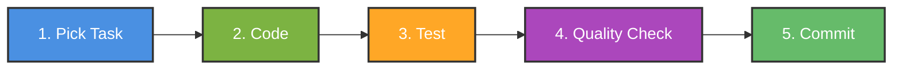

# Workshop: AI-Assisted Development with Claude Code Agents

**Goal**: Learn how to use Claude Code agents to implement your assigned development tasks efficiently and with high quality.

**Workshop Duration**: 3 hours hands-on

**Environment**: This workshop uses **Claude Code** (CLI/VS Code extension), not Claude Desktop. All instructions assume you're using Claude Code in your terminal or IDE.

**What You Have**: Development tasks in `documents/03-dev-tasks/` with detailed requirements, acceptance criteria, and technical notes.

**What You'll Learn**: How to translate those task cards into production-ready code using AI agents and Playwright MCP for testing.

---

## Your Daily Workflow (Simple 5-Step Process)



### Step 1: Pick Your Task (2 min)
Open your task file and find your assigned task:
```bash
# Example: You're assigned TASK-012 from login-authentication-dev-tasks.md
open documents/03-dev-tasks/login-authentication-dev-tasks.md
```

### Step 2: Code It (Main work)
Use the right agent based on what the task needs

### Step 3: Test It (After coding)
Write tests for what you built

### Step 4: Quality Check (Before commit)
Run code review, security, and performance checks

### Step 5: Commit (Final)
Commit with clear message referencing the task

---

## Step 2: Code It - Which Agent to Use?

Look at your task's **Role** and **Description** to pick the right agent:

### Quick Agent Selection Table

| Your Task Involves | Use This Agent | Example Prompt |
|-------------------|----------------|----------------|
| Database schema, migrations | `database` | `Use database to implement TASK-002` |
| API endpoints, Server Actions, tRPC | `backend-api` | `Use backend-api to implement TASK-011` |
| UI components, forms, buttons | `frontend-ui` | `Use frontend-ui to implement TASK-012` |
| Next.js pages, layouts, routing | `fullstack-nextjs` | `Use fullstack-nextjs to implement TASK-023` |
| Complete feature (DB + API + UI) | `/workflow-implement-fullstack` | `/workflow-implement-fullstack` then paste task |
| Authentication, security | `security` + `backend-api` | Chain: security design → backend-api implement |
| Performance optimization | `performance` | `Use performance to implement TASK-044` |

### Real Examples from Your Tasks

#### Example 1: Database Task (TASK-002)

**Your Task Card Says:**
```
TASK-002: Create Prisma schema for authentication
Role: Backend
Description: Design and implement Prisma schema with User, Account, Session models...
Acceptance Criteria:
- User model created with email, password, firstName, lastName
- Account model for OAuth provider data
- Proper indexes and relationships
```

**What You Do:**
```bash
Use database to implement TASK-002 from documents/03-dev-tasks/login-authentication-dev-tasks.md

Create Prisma schema with these models:
1. User (email, password, firstName, lastName, profilePhoto, role)
2. Account (for OAuth - Google, Facebook)
3. Session (NextAuth.js session management)
4. VerificationToken (magic link authentication)
5. ActivationToken (account activation)

Include:
- Indexes on email fields and foreign keys
- Unique constraints on email
- UserRole enum (BUYER, ADMIN, SUPPORT)
- Timestamps (createdAt, updatedAt)
- Prisma Adapter compatibility for NextAuth.js
```

**Agent Response**: Creates complete Prisma schema file with all models

---

#### Example 2: UI Component Task (TASK-012)

**Your Task Card Says:**
```
TASK-012: Build login page UI with email input
Role: Fullstack
Description: Create login page with email input form, loading states, OAuth buttons...
Dependencies: TASK-011 (email login server action must be done first)
Acceptance Criteria:
- Email input with validation
- Submit button with loading state
- Google and Facebook OAuth buttons
- Error message display
- Success message "Check your email"
```

**What You Do:**
```bash
Use frontend-ui to implement TASK-012 from documents/03-dev-tasks/login-authentication-dev-tasks.md

Create login page UI with:
1. Email input form with Zod validation
2. Submit button with loading spinner
3. OAuth buttons for Google and Facebook
4. Error message area (rate limit, invalid email)
5. Success message: "Check your email for magic link"

Technical requirements:
- Use shadcn/ui components (Card, Input, Button)
- Client Component (needs form state)
- Integrate with TASK-011 server action (already implemented)
- Responsive design (mobile and desktop)
- Accessibility (ARIA labels, keyboard navigation)
```

**Agent Response**: Creates login page component with all requirements

---

#### Example 3: API/Backend Task (TASK-021)

**Your Task Card Says:**
```
TASK-021: Create getDashboardData server action
Role: Backend
Description: Create server action that fetches dashboard data from multiple sources...
Dependencies: TASK-013,TASK-014,TASK-015,TASK-016 (repositories must exist)
Acceptance Criteria:
- Fetch user profile data
- Fetch properties from SAP
- Fetch notifications from Salesforce
- Fetch messages
- Return aggregated dashboard data
```

**What You Do:**
```bash
Use backend-api to implement TASK-021 from documents/03-dev-tasks/dashboard-dev-tasks.md

Create getDashboardData server action that:
1. Fetches authenticated user profile
2. Queries properties from Property repository (SAP mock)
3. Queries notifications from Notification repository (Salesforce mock)
4. Queries messages from Message repository
5. Returns aggregated data for dashboard

Dependencies (already implemented):
- User repository (TASK-013)
- Property repository (TASK-014)
- Notification repository (TASK-015)
- Message repository (TASK-016)

Return type:
{
  user: User,
  properties: Property[],
  notifications: Notification[],
  messages: Message[]
}

Include error handling and proper TypeScript types.
```

**Agent Response**: Creates server action with all data fetching logic

---

## Step 3: Test It

After coding, immediately write tests. Your task card often includes testing requirements.

### Testing Tasks

Look for tasks like:
- TASK-037: Create unit tests for authentication services
- TASK-039: Implement E2E tests for login flows
- TASK-046: Write unit tests for repositories and use cases

### Quick Testing Guide

**For Unit Tests:**
```bash
Use qa-tester to write unit tests for TASK-011

Test cases from acceptance criteria:
- Valid email creates verification token
- Invalid email returns error
- Rate limit enforced (3 attempts per 15 min)
- Token expires after 15 minutes
- Email is sent with correct magic link
```

**For E2E Tests with Playwright:**
```bash
Use qa-tester to write Playwright E2E tests for TASK-012

User flow to test:
1. Navigate to /login
2. Enter valid email
3. Click submit
4. See loading state
5. See success message "Check your email"
6. Try 4th attempt - see rate limit error
7. Try invalid email - see validation error
```

**Use Comprehensive Testing Workflow:**
```bash
/workflow-qa-e2e

Feature to test: Login flow (TASK-012 + TASK-011)
Include: Unit tests, integration tests, Playwright E2E tests
```

---

## Playwright & Playwright MCP Integration

Playwright is our E2E testing framework. Playwright MCP allows Claude Code to interact with your browser for testing and debugging.

**Note**: This guide is for **Claude Code** (CLI/VS Code extension), not Claude Desktop. Playwright MCP is available through Docker MCP integration in Claude Code.

### Setup Playwright (One-time)

**Install Playwright:**
```bash
npm install -D @playwright/test
npx playwright install
```

**Create Playwright config:**
```bash
# Generate playwright.config.ts
npx playwright init
```

**Configure for Next.js:**
```typescript
// playwright.config.ts
import { defineConfig, devices } from '@playwright/test';

export default defineConfig({
  testDir: './tests/e2e',
  fullyParallel: true,
  forbidOnly: !!process.env.CI,
  retries: process.env.CI ? 2 : 0,
  workers: process.env.CI ? 1 : undefined,
  reporter: 'html',
  use: {
    baseURL: 'http://localhost:3000',
    trace: 'on-first-retry',
  },
  projects: [
    {
      name: 'chromium',
      use: { ...devices['Desktop Chrome'] },
    },
  ],
  webServer: {
    command: 'npm run dev',
    url: 'http://localhost:3000',
    reuseExistingServer: !process.env.CI,
  },
});
```

### Setup Playwright MCP (One-time)

Playwright MCP allows Claude Code to control your browser for testing and debugging.

**Note**: Playwright MCP is already available in Claude Code if you have Docker MCP configured. The browser automation tools are available through the `mcp__MCP_DOCKER__browser_*` functions.

**Verify Playwright MCP is available:**
```bash
# In Claude Code, check if browser tools are available by asking:
# "Do I have access to Playwright MCP browser tools?"
# You should see mcp__MCP_DOCKER__browser_navigate, browser_click, etc.
```

**If Playwright MCP is not available**, configure Docker MCP in your project:

Add to `.claude/mcp.json` in your project root:

```json
{
  "mcpServers": {
    "MCP_DOCKER": {
      "command": "docker",
      "args": [
        "run",
        "-i",
        "--rm",
        "mcp/playwright"
      ]
    }
  }
}
```

**No restart needed** - Claude Code loads MCP servers automatically from project configuration.

**Troubleshooting**:
- If browser tools aren't available, make sure Docker is running on your machine
- Docker is required for Playwright MCP in Claude Code
- You can verify by running: `docker ps` (should show running containers or at least not error)
- If you don't have Docker, you can still write Playwright tests manually - just won't have interactive MCP testing

### Writing E2E Tests with Playwright

#### Method 1: Let Agent Write Tests (Recommended)

**For simple flows:**
```bash
Use qa-tester to write Playwright E2E test for login flow (TASK-012)

Test file: tests/e2e/login.spec.ts

Test scenarios:
1. User can see login page
2. User can enter email and submit
3. Loading state shows during submission
4. Success message appears after submit
5. Error shows for invalid email format
6. Rate limit message after 3 attempts

Use Playwright best practices:
- Page Object Model
- Data-testid selectors
- Proper waits (no arbitrary timeouts)
- Clear test descriptions
```

**Agent creates:**
```typescript
// tests/e2e/login.spec.ts
import { test, expect } from '@playwright/test';

test.describe('Login Flow', () => {
  test('should display login page', async ({ page }) => {
    await page.goto('/login');
    await expect(page.getByRole('heading', { name: 'Login' })).toBeVisible();
    await expect(page.getByLabel('Email')).toBeVisible();
  });

  test('should submit email and show success message', async ({ page }) => {
    await page.goto('/login');

    await page.getByLabel('Email').fill('user@example.com');
    await page.getByRole('button', { name: 'Continue' }).click();

    // Loading state
    await expect(page.getByRole('button', { name: 'Continue' })).toBeDisabled();

    // Success message
    await expect(page.getByText('Check your email')).toBeVisible();
  });

  test('should show error for invalid email', async ({ page }) => {
    await page.goto('/login');

    await page.getByLabel('Email').fill('invalid-email');
    await page.getByRole('button', { name: 'Continue' }).click();

    await expect(page.getByText('Invalid email format')).toBeVisible();
  });
});
```

#### Method 2: Interactive Testing with Playwright MCP

Use Playwright MCP to **interactively test your app** and let Claude see what's happening.

**Start your app:**
```bash
npm run dev
```

**Tell Claude Code to test using MCP:**
```bash
Use Playwright MCP to test the login page at http://localhost:3000/login

Steps to perform:
1. Navigate to login page
2. Take screenshot
3. Fill email input with "test@example.com"
4. Click submit button
5. Wait for success message
6. Take screenshot of result

Report any issues found
```

**What Claude Code can do with Playwright MCP:**
- Navigate to pages (`mcp__MCP_DOCKER__browser_navigate`)
- Take screenshots (`mcp__MCP_DOCKER__browser_take_screenshot`)
- Click elements (`mcp__MCP_DOCKER__browser_click`)
- Fill forms (`mcp__MCP_DOCKER__browser_type`)
- Check element visibility (`mcp__MCP_DOCKER__browser_snapshot`)
- Get console errors (`mcp__MCP_DOCKER__browser_console_messages`)
- Monitor network requests (`mcp__MCP_DOCKER__browser_network_requests`)

**Note**: Claude Code will use these MCP tools automatically when you ask it to test with Playwright MCP.

**Example - Debug a failing feature:**
```bash
Use Playwright MCP to debug the login form

Context: Users report the submit button doesn't work

Please:
1. Navigate to http://localhost:3000/login
2. Take screenshot of initial state
3. Fill email with "test@example.com"
4. Click submit button
5. Check console for errors
6. Check network requests
7. Take screenshot after submission
8. Report what you found
```

**Claude will interact with the browser and report:**
```
I found the issue:
1. Submit button is clicked successfully
2. Console shows error: "validateEmail is not defined"
3. Network request to /api/auth/signin never fires
4. Form submission is blocked by JavaScript error

The issue is in components/auth/login-form.tsx line 23.
The validateEmail function is imported but not defined.
```

### Playwright Best Practices

#### 1. Use Data-testid for Stable Selectors

**Add to your components:**
```tsx
// components/auth/login-form.tsx
export function LoginForm() {
  return (
    <form data-testid="login-form">
      <input
        type="email"
        data-testid="email-input"
        aria-label="Email"
      />
      <button data-testid="submit-button" type="submit">
        Continue
      </button>
      <div data-testid="error-message" role="alert">
        {error}
      </div>
    </form>
  );
}
```

**Use in tests:**
```typescript
await page.getByTestId('email-input').fill('test@example.com');
await page.getByTestId('submit-button').click();
await expect(page.getByTestId('error-message')).toHaveText('Invalid email');
```

#### 2. Page Object Model

**Create page objects for reusability:**
```typescript
// tests/e2e/pages/login.page.ts
import { Page } from '@playwright/test';

export class LoginPage {
  constructor(private page: Page) {}

  async goto() {
    await this.page.goto('/login');
  }

  async fillEmail(email: string) {
    await this.page.getByTestId('email-input').fill(email);
  }

  async submit() {
    await this.page.getByTestId('submit-button').click();
  }

  async expectSuccessMessage() {
    await this.page.getByText('Check your email').waitFor();
  }

  async expectError(message: string) {
    await this.page.getByTestId('error-message').waitFor();
    await this.page.getByText(message).waitFor();
  }
}
```

**Use in tests:**
```typescript
import { LoginPage } from './pages/login.page';

test('successful login', async ({ page }) => {
  const loginPage = new LoginPage(page);

  await loginPage.goto();
  await loginPage.fillEmail('test@example.com');
  await loginPage.submit();
  await loginPage.expectSuccessMessage();
});
```

#### 3. Fixtures for Test Data

**Create fixtures:**
```typescript
// tests/e2e/fixtures.ts
import { test as base } from '@playwright/test';

export const test = base.extend({
  testUser: async ({}, use) => {
    const user = {
      email: 'test@example.com',
      firstName: 'Test',
      lastName: 'User',
    };
    await use(user);
  },
});
```

**Use in tests:**
```typescript
import { test } from './fixtures';

test('login with test user', async ({ page, testUser }) => {
  await page.goto('/login');
  await page.getByLabel('Email').fill(testUser.email);
  // ...
});
```

### Common Playwright Testing Patterns

#### Pattern 1: Testing Forms

```typescript
test('contact form validation', async ({ page }) => {
  await page.goto('/contact');

  // Test empty submission
  await page.getByTestId('submit-button').click();
  await expect(page.getByText('Email is required')).toBeVisible();

  // Test invalid email
  await page.getByLabel('Email').fill('invalid');
  await page.getByTestId('submit-button').click();
  await expect(page.getByText('Invalid email format')).toBeVisible();

  // Test successful submission
  await page.getByLabel('Email').fill('test@example.com');
  await page.getByLabel('Message').fill('Test message');
  await page.getByTestId('submit-button').click();
  await expect(page.getByText('Message sent successfully')).toBeVisible();
});
```

#### Pattern 2: Testing Authentication

```typescript
test.describe('authenticated user', () => {
  test.use({
    storageState: 'tests/e2e/.auth/user.json', // Reuse auth state
  });

  test('can access dashboard', async ({ page }) => {
    await page.goto('/dashboard');
    await expect(page.getByRole('heading', { name: 'Dashboard' })).toBeVisible();
  });
});
```

#### Pattern 3: Testing API Interactions

```typescript
test('dashboard loads data', async ({ page }) => {
  // Mock API response
  await page.route('**/api/dashboard', async (route) => {
    await route.fulfill({
      status: 200,
      body: JSON.stringify({
        user: { name: 'Test User' },
        properties: [{ id: 1, name: 'Property 1' }],
      }),
    });
  });

  await page.goto('/dashboard');
  await expect(page.getByText('Test User')).toBeVisible();
  await expect(page.getByText('Property 1')).toBeVisible();
});
```

#### Pattern 4: Testing Responsive Design

```typescript
test('mobile navigation', async ({ page }) => {
  // Set mobile viewport
  await page.setViewportSize({ width: 375, height: 667 });

  await page.goto('/');

  // Hamburger menu should be visible on mobile
  await expect(page.getByTestId('hamburger-menu')).toBeVisible();

  // Click hamburger to open menu
  await page.getByTestId('hamburger-menu').click();
  await expect(page.getByRole('navigation')).toBeVisible();
});
```

### Running Playwright Tests

**Run all tests:**
```bash
npx playwright test
```

**Run specific test file:**
```bash
npx playwright test tests/e2e/login.spec.ts
```

**Run in headed mode (see browser):**
```bash
npx playwright test --headed
```

**Run in debug mode:**
```bash
npx playwright test --debug
```

**Run in UI mode (interactive):**
```bash
npx playwright test --ui
```

**View test report:**
```bash
npx playwright show-report
```

### Playwright MCP Commands Reference

When using Playwright MCP through Claude, you can ask Claude to:

**Navigation:**
- "Navigate to http://localhost:3000/login"
- "Go to the dashboard page"
- "Click the back button"

**Interaction:**
- "Click the submit button"
- "Fill the email input with test@example.com"
- "Select 'Option 1' from the dropdown"
- "Check the terms checkbox"

**Verification:**
- "Take a screenshot"
- "Check if error message is visible"
- "Get the page title"
- "Check console for errors"
- "List all network requests"

**Debugging:**
- "Find all buttons on the page"
- "Get the text of the error message"
- "Check if the form is disabled"
- "Take screenshot of the login form only"

### Example: Using Playwright MCP for Task Testing

**Your task: TASK-039 (Implement E2E tests for login flows)**

**Step 1: Manual exploration with MCP**
```bash
Use Playwright MCP to explore the login flow

Start the app (npm run dev should be running)

Please test this flow:
1. Go to http://localhost:3000/login
2. Take screenshot of initial state
3. Try submitting empty form - what happens?
4. Try invalid email - what happens?
5. Try valid email - what happens?
6. Take screenshots at each step
7. Check console for any errors

Report what you observe so I can write proper tests
```

**Step 2: Write tests based on observations**
```bash
Use qa-tester to write Playwright tests for TASK-039

Based on the manual testing with MCP, write comprehensive E2E tests for:
1. Empty form submission shows validation errors
2. Invalid email shows error message
3. Valid email shows success message
4. Rate limiting after 3 attempts
5. OAuth buttons are clickable and redirect properly

Use the Page Object Model pattern.
```

### Troubleshooting Playwright

**Problem: Tests timeout**
```typescript
// Increase timeout for slow operations
test('slow operation', async ({ page }) => {
  test.setTimeout(60000); // 60 seconds

  await page.goto('/dashboard');
  // ...
});
```

**Problem: Element not found**
```typescript
// Use proper waits
await page.getByTestId('submit-button').waitFor({ state: 'visible' });
await page.getByTestId('submit-button').click();
```

**Problem: Flaky tests**
```typescript
// Use auto-waiting instead of arbitrary timeouts
// ❌ Bad
await page.waitForTimeout(3000);

// ✅ Good
await expect(page.getByText('Success')).toBeVisible();
```

**Problem: Test works locally but fails in CI**
```typescript
// Use CI-specific configuration
export default defineConfig({
  retries: process.env.CI ? 2 : 0,
  workers: process.env.CI ? 1 : undefined,
  use: {
    trace: 'on-first-retry',
    video: 'retain-on-failure',
  },
});
```

---

## Step 4: Quality Check (3 Checks)

Before committing, run these 3 checks to ensure production quality:

### Check 1: Code Review (15 min)
```bash
/workflow-review-code

Files implemented:
- [List files you created/modified]

Task reference: TASK-XXX from documents/03-dev-tasks/[feature]-dev-tasks.md
```

**What it checks:**
- Code quality and TypeScript types
- Error handling
- Best practices
- Accessibility
- Performance issues

**Action**: Fix any issues found, then re-run review until clean

---

### Check 2: Security Audit (15 min)
```bash
/workflow-review-security

Task: TASK-XXX (authentication/data handling/API)
Focus: OWASP Top 10, input validation, authentication security
```

**Critical for tasks involving:**
- Authentication (login, signup, OAuth)
- User input (forms, search)
- Data storage (database operations)
- API endpoints (server actions, tRPC)
- File uploads

**Action**: Fix security issues immediately - security is non-negotiable

---

### Check 3: Performance Check (10 min)
```bash
/workflow-review-performance

Feature: [What you built]
Check: Load time, bundle size, Core Web Vitals
```

**Important for tasks involving:**
- UI components (bundle size)
- Dashboard/pages (load time)
- API calls (response time)
- Database queries (N+1 queries)

**Action**: Apply optimizations suggested

---

## Step 5: Commit

After all quality checks pass, commit your work.

### Commit Message Format

```bash
git add .

git commit -m "feat: [brief description from task title]

Implemented TASK-XXX: [Full task title]

Changes:
- [What you created/modified]
- [Key technical decisions]
- [Dependencies used]

Testing:
- [X] Unit tests passing
- [X] E2E tests passing
- [X] Code review clean
- [X] Security audit passed
- [X] Performance optimized

Task: TASK-XXX
File: documents/03-dev-tasks/[feature]-dev-tasks.md
Dependencies: [List dependency tasks if any]
"
```

### Real Commit Example

```bash
git commit -m "feat: implement login page with magic link authentication

Implemented TASK-012: Build login page UI with email input

Changes:
- Created app/(auth)/login/page.tsx with login layout
- Created components/auth/login-form.tsx with email validation
- Integrated with TASK-011 server action
- Added OAuth buttons for Google and Facebook
- Implemented loading states and error handling
- Added success message 'Check your email for magic link'

Technical decisions:
- Used Client Component for form state management
- shadcn/ui Card, Input, Button components
- Zod schema for email validation
- useFormState hook for server action integration

Testing:
- [X] 8 unit tests passing (login-form.test.tsx)
- [X] 6 E2E tests passing (login.spec.ts)
- [X] Code review clean (no issues)
- [X] Security audit passed (input validation, CSRF)
- [X] Performance optimized (LCP 1.2s, bundle size OK)

Task: TASK-012
File: documents/03-dev-tasks/login-authentication-dev-tasks.md
Dependencies: TASK-011 (email login server action)
"
```

---

## Hands-On Exercise (Workshop Activity)

### Exercise 1: Implement a Simple Task (45 min)

**Pick a task**: TASK-001 (Setup Neon DB PostgreSQL database)

1. **Read the task** (5 min)
   - Open: `documents/03-dev-tasks/login-authentication-dev-tasks.md`
   - Find TASK-001
   - Read: User Story, Description, Acceptance Criteria, Technical Notes

2. **Implement** (15 min)
   ```bash
   Use database to implement TASK-001

   Setup Neon DB PostgreSQL database:
   - Create Neon DB project with PostgreSQL 16
   - Configure connection pooling
   - Setup environment variables (DATABASE_URL, DIRECT_DATABASE_URL)
   - Separate dev and production environments
   - Test connection from Next.js
   ```

3. **Quality Check** (15 min)
   ```bash
   /workflow-review-code
   # Fix any issues

   /workflow-review-security
   # Verify environment variables are secure
   ```

4. **Commit** (10 min)
   ```bash
   git commit -m "feat: setup Neon DB PostgreSQL database

   Implemented TASK-001: Setup Neon DB PostgreSQL database

   Changes:
   - Created Neon DB project with PostgreSQL 16
   - Configured connection pooling
   - Added DATABASE_URL and DIRECT_DATABASE_URL to .env.local
   - Separated dev and production environments
   - Tested connection from Next.js app

   Testing:
   - [X] Database connection successful
   - [X] Security review passed (env vars in .gitignore)

   Task: TASK-001
   File: documents/03-dev-tasks/login-authentication-dev-tasks.md
   Dependencies: None
   "
   ```

---

### Exercise 2: Implement a Full Feature Task (90 min)

**Pick a task**: TASK-012 (Build login page UI)

Follow all 5 steps:

1. **Read task** → Understand requirements
2. **Code** → Use `frontend-ui` agent
3. **Test** → Use `qa-tester` agent
4. **Quality** → Run 3 checks (code, security, performance)
5. **Commit** → Clear commit message

**Challenge**: Complete in under 90 minutes (task estimate is 6 hours, but AI speeds you up!)

---

### Exercise 3: Complex Task with Dependencies (60 min)

**Pick a task**: TASK-020 (Create getDashboardData use case)

**Key learning**: Check dependencies first!

1. **Check dependencies** (5 min)
   - Task says: "Dependencies: TASK-013,TASK-014,TASK-015,TASK-016"
   - Verify these are done (repositories exist)

2. **Implement** (30 min)
   ```bash
   Use backend-api to implement TASK-020

   Context: Repositories already implemented (TASK-013 through TASK-016)

   [Paste full task description]
   ```

3. **Test integration** (15 min)
   ```bash
   Use qa-tester to write integration tests

   Test that getDashboardData correctly:
   - Calls all 4 repositories
   - Aggregates data properly
   - Handles errors from each source
   - Returns correct TypeScript types
   ```

4. **Quality + Commit** (10 min)

---

### Exercise 4: Interactive Testing with Playwright MCP (45 min)

**Pick a task**: TASK-039 (Implement E2E tests for login flows)

**Key learning**: Use Playwright MCP for exploration before writing tests

**Prerequisites**:
- Login feature already implemented (TASK-012)
- App running (`npm run dev`)
- Playwright MCP configured

**Step 1: Manual exploration (15 min)**
```bash
Use Playwright MCP to explore and test the login flow at http://localhost:3000/login

Please perform these actions and report findings:
1. Navigate to login page
2. Take screenshot of initial state
3. Try submitting empty form
4. Take screenshot of validation errors
5. Fill email with "invalid-email"
6. Submit and take screenshot
7. Fill email with "test@example.com"
8. Submit and take screenshot of success
9. Check console for any errors
10. List all network requests made

For each step, describe what you see and any issues.
```

**Step 2: Debug any issues found (10 min)**

If MCP found issues:
```bash
Use Playwright MCP to debug [specific issue]

Context: [Issue description from Step 1]

Please:
- Take detailed screenshots
- Check console errors
- Monitor network requests
- Identify root cause
```

Then fix the issue with appropriate agent:
```bash
Use frontend-ui to fix [issue description]
```

**Step 3: Write automated tests (15 min)**
```bash
Use qa-tester to write Playwright E2E tests for TASK-039

Based on the manual testing with Playwright MCP, write tests for:
1. Login page displays correctly (screenshot showed: X, Y, Z)
2. Empty form shows validation errors (observed: "Email is required")
3. Invalid email shows error (observed: "Invalid email format")
4. Valid email shows success message (observed: "Check your email for magic link")
5. Rate limiting after 3 attempts (need to test)

Use Page Object Model pattern with data-testid selectors.
Create tests/e2e/login.spec.ts
```

**Step 4: Run tests and verify (5 min)**
```bash
# Run the Playwright tests
npx playwright test tests/e2e/login.spec.ts --headed

# If tests fail, debug with MCP again
Use Playwright MCP to debug failing test: [test name]
```

**Bonus Challenge**: Test OAuth buttons
```bash
Use Playwright MCP to test OAuth flow

1. Click Google OAuth button
2. Check redirect URL
3. Verify correct OAuth parameters
4. Take screenshot

Report findings.
```

---

## Agent Cheat Sheet

### Most Common Agents You'll Use

| Agent | When to Use | Command Format |
|-------|-------------|----------------|
| `database` | Prisma schemas, migrations | `Use database to implement TASK-XXX` |
| `backend-api` | Server Actions, tRPC, APIs | `Use backend-api to implement TASK-XXX` |
| `frontend-ui` | Components, forms, UI | `Use frontend-ui to implement TASK-XXX` |
| `fullstack-nextjs` | Pages, layouts, routing | `Use fullstack-nextjs to implement TASK-XXX` |
| `qa-tester` | Unit/E2E/Playwright tests | `Use qa-tester to write tests for TASK-XXX` |
| **Playwright MCP** | **Interactive browser testing** | **`Use Playwright MCP to test [feature]`** |
| `security` | Security review | `/workflow-review-security` |
| `performance` | Performance optimization | `/workflow-review-performance` |
| `code-reviewer` | Code quality check | `/workflow-review-code` |

### Playwright MCP Special Commands

**Interactive Testing & Debugging:**
- `Use Playwright MCP to test the login page` - Test features interactively
- `Use Playwright MCP to debug [feature]` - Debug issues with screenshots and console logs
- `Use Playwright MCP to take screenshots of [page]` - Visual verification
- `Use Playwright MCP to check console errors on [page]` - Find JavaScript errors
- `Use Playwright MCP to monitor network requests on [page]` - Debug API calls

### The "Always Paste Your Task" Pattern

**Best practice**: Always paste the full task when prompting agents

```bash
Use [agent-name] to implement TASK-XXX from documents/03-dev-tasks/[feature]-dev-tasks.md

[Paste full task details including:]
- User Story
- Description
- Acceptance Criteria
- Technical Notes

[Add any additional context like:]
- Dependencies status (done/not done)
- Technical stack decisions
- Special requirements
```

**Why?** The agent gets complete context and builds exactly what's in the acceptance criteria.

---

## Best Practices

### ✅ DO

1. **Read the full task** before prompting the agent
   - User Story (why)
   - Description (what)
   - Acceptance Criteria (checklist)
   - Technical Notes (how)

2. **Check dependencies first**
   - Don't start TASK-012 if TASK-011 isn't done
   - Ask team: "Is TASK-011 completed?"

3. **Copy-paste task details** into agent prompts
   - Don't paraphrase or summarize
   - Agent needs full context

4. **Test immediately** after coding
   - While task context is fresh
   - Easier to debug

5. **Run all 3 quality checks** before committing
   - Code review
   - Security
   - Performance

6. **Reference task in commits**
   - `Task: TASK-XXX`
   - `File: documents/03-dev-tasks/...`

### ❌ DON'T

1. **Don't skip quality checks**
   - "I'll fix it later" = technical debt
   - Takes 30 min now, 3 hours later

2. **Don't commit without tests**
   - No tests = production bugs
   - Tests save debugging time

3. **Don't ignore dependencies**
   - Building TASK-020 before TASK-013-016 = wasted work
   - Check dependencies are done first

4. **Don't vague prompts**
   - ❌ "Build login page"
   - ✅ "Implement TASK-012 with all acceptance criteria"

5. **Don't skip acceptance criteria**
   - Every checkbox in acceptance criteria must be done
   - Agent helps you complete ALL criteria

---

## Troubleshooting

### Problem: "Agent doesn't understand what I need"

**Solution**: Paste the full task from the markdown file
```bash
Use backend-api to implement TASK-011

[Copy entire task section from markdown, including:]
- User Story: As a user, I want to...
- Description: ...
- Acceptance Criteria:
  - [ ] ...
- Technical Notes: ...
```

---

### Problem: "My task depends on other tasks not done yet"

**Solution**:
1. Ask team which tasks are done
2. Only pick tasks where all dependencies are complete
3. If blocked, pick a different task with no dependencies or completed dependencies

---

### Problem: "Quality check found issues"

**Solution**: Fix and re-check
```bash
/workflow-review-code
# Finds 5 issues

Use [appropriate-agent] to fix these issues:
1. [Issue 1 description]
2. [Issue 2 description]
...

# After fixing
/workflow-review-code
# Should be clean now
```

---

### Problem: "Agent created something different from acceptance criteria"

**Solution**: Be more specific and reference acceptance criteria explicitly
```bash
Use frontend-ui to implement login form

IMPORTANT: Must meet ALL acceptance criteria from TASK-012:
- [ ] Email input with validation
- [ ] Submit button with loading state
- [ ] Google OAuth button
- [ ] Facebook OAuth button
- [ ] Error message display
- [ ] Success message "Check your email"

Each checkbox must be completed. Do not skip any.
```

---

## Quick Reference: Your First Day

### Morning (Setup)
```bash
# 1. Verify Playwright MCP is available in Claude Code
# In Claude Code, you can ask: "Do I have browser testing tools?"
# Should see mcp__MCP_DOCKER__browser_* functions available

# 2. Install Playwright in your project (if not done)
npm install -D @playwright/test
npx playwright install

# 3. Start your dev server
npm run dev

# 4. Open your task file in Claude Code
# Navigate to documents/03-dev-tasks/[your-feature]-dev-tasks.md

# 5. Find tasks with no dependencies
# Look for: Dependencies: None

# 6. Pick your first task
# Criteria: High priority + No dependencies + Matches your skill
```

### Working on Task (Repeat for each task)
```bash
# 1. Read task thoroughly (5 min)

# 2. Code with agent (30-120 min depending on task)
Use [agent] to implement TASK-XXX

# 3. Test with Playwright MCP first (10 min) - Interactive exploration
Use Playwright MCP to test [feature] at http://localhost:3000/[page]
# Take screenshots, check console, verify behavior

# 4. Write automated tests (20 min)
Use qa-tester to write Playwright tests for TASK-XXX based on MCP findings

# 5. Quality checks (30 min)
/workflow-review-code
/workflow-review-security
/workflow-review-performance

# 6. Commit (5 min)
git commit -m "feat: [task title]..."
```

### End of Day (Review)
```bash
# Check what you completed today
git log --oneline --since="today"

# Update team on progress
# Mark completed tasks in project tracker
```

---

## Playwright MCP Debugging Scenarios

Common debugging scenarios using Playwright MCP:

### Scenario 1: Button Click Not Working

```bash
Use Playwright MCP to debug submit button issue

Context: Users report submit button does nothing

Steps:
1. Navigate to http://localhost:3000/login
2. Take screenshot
3. Click submit button with data-testid="submit-button"
4. Check console for JavaScript errors
5. Monitor network requests
6. Report findings
```

### Scenario 2: Form Validation Not Showing

```bash
Use Playwright MCP to debug form validation

Context: Error messages not appearing

Steps:
1. Go to login page
2. Submit empty form
3. Take screenshot
4. Check if error elements exist in DOM
5. Check console for errors
6. Report what's missing
```

### Scenario 3: Responsive Design Issues

```bash
Use Playwright MCP to test mobile responsiveness

Context: Dashboard looks broken on mobile

Steps:
1. Resize browser to 375x667 (mobile)
2. Navigate to http://localhost:3000/dashboard
3. Take screenshot
4. Check if hamburger menu is visible
5. Try clicking menu items
6. Take screenshots of any layout issues
7. Resize to 1920x1080 (desktop)
8. Compare layout differences
```

### Scenario 4: API Call Failing

```bash
Use Playwright MCP to debug API call

Context: Dashboard not loading data

Steps:
1. Navigate to http://localhost:3000/dashboard
2. Monitor network requests
3. Check for failed API calls
4. Check console for errors
5. Take screenshot of empty state
6. Report API endpoint, status code, error message
```

### Scenario 5: OAuth Redirect Issue

```bash
Use Playwright MCP to test Google OAuth flow

Context: OAuth button not redirecting correctly

Steps:
1. Go to login page
2. Click Google OAuth button
3. Check redirect URL
4. Check URL parameters (client_id, redirect_uri, etc.)
5. Take screenshot
6. Report redirect destination and parameters
```

---

## Summary

**The 5-Step Workflow:**
1. **Pick Task** → Open task file, read full task
2. **Code It** → Use right agent with full task context
3. **Test It** → Write tests immediately (use Playwright MCP for exploration!)
4. **Quality Check** → Code review + Security + Performance
5. **Commit** → Clear message referencing task

**Key Success Factors:**
- Always paste the FULL task details to agents
- Check dependencies before starting
- Complete ALL acceptance criteria
- Use Playwright MCP for interactive testing and debugging
- Run quality checks before committing
- Reference task number in commits

**Time Expectations:**
- Simple tasks (4h estimate): ~2-3 hours with AI
- Medium tasks (6-8h estimate): ~3-5 hours with AI
- Complex tasks (10-12h estimate): ~5-7 hours with AI

**AI speeds you up ~40-50%**, and Playwright MCP makes debugging 10x faster with visual feedback.

---

## Next Steps

- **Start with Exercise 1** in this workshop
- **Practice the 5-step workflow** on 2-3 tasks
- **Read** [Best Practices Guide](best-practices.md) for advanced tips
- **Explore** [Workflow Commands](../architecture/workflow-commands.md) for complex features

**Ready?** Open `documents/03-dev-tasks/` and pick your first task!
