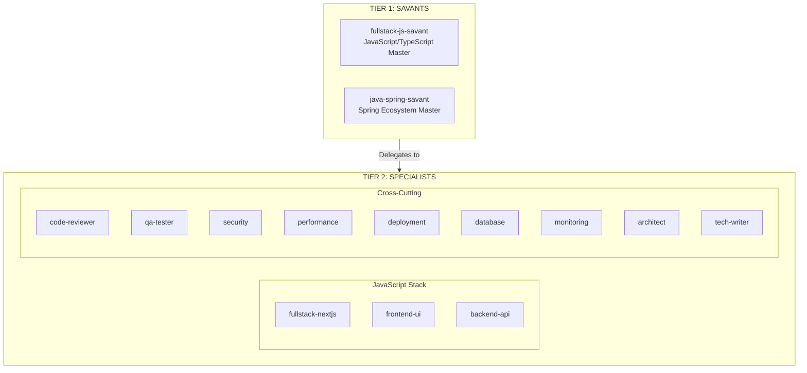
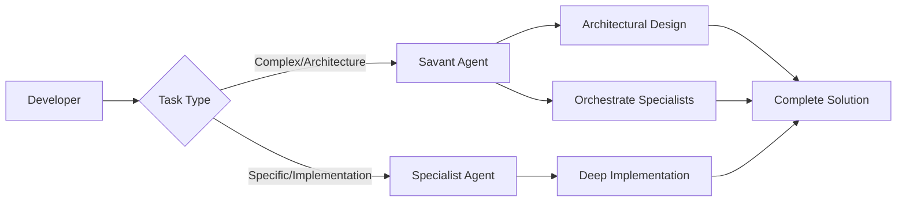

# MCP Sub-Agents for Enterprise Development

A comprehensive collection of specialized Claude Code agents with domain expert savants and hybrid workflow commands for building production-ready, enterprise-grade applications.

## Overview

MCP Sub-Agents implements a two-tier agent architecture designed to provide deep technical expertise across multiple technology stacks. This system combines the broad knowledge of savant orchestrators with the focused expertise of specialist implementers.



## Key Features

### Two-Tier Architecture

**Tier 1: Savant Agents**

Master orchestrators with broad, deep knowledge across entire technology ecosystems. Savants make architectural decisions, choose technologies, and coordinate specialist agents.

- fullstack-js-savant - JavaScript/TypeScript ecosystem master
- java-spring-savant - Spring ecosystem master

**Tier 2: Specialist Agents**

Deep domain experts focusing on specific frameworks, tools, and practices within a stack.

- JavaScript specialists for Next.js, UI, and APIs
- Cross-cutting specialists for security, testing, performance, and more

### Hybrid Workflow Commands

Structured slash commands that combine development workflow stages with technology expertise for guided, structured development:

- `/mcp-design-architecture` - System architecture design
- `/mcp-implement-fullstack` - End-to-end feature implementation
- `/mcp-review-code` - Comprehensive code quality review
- `/mcp-qa-e2e` - End-to-end testing with Playwright
- `/mcp-deploy` - Production deployment with CI/CD

[View all workflow commands](architecture/workflow-commands.md)

## Why Use MCP Sub-Agents?

### Production-Ready Expertise

Each agent provides comprehensive guidance for building enterprise-grade applications with modern best practices, security considerations, and performance optimizations.

### Flexible Usage

Use savants for complex architectural decisions or specialists for focused implementation tasks. Mix and match based on your needs.

### Guided Workflows

Workflow commands provide step-by-step guidance through design, implementation, review, QA, and deployment phases.

### Technology-Specific

Deep expertise in modern JavaScript/TypeScript stack including Next.js 15+, React Server Components, tRPC, Prisma, and more.

## Quick Start

### Installation

Install all agents and workflow commands with one command:

```bash
curl -fsSL https://raw.githubusercontent.com/rcdelacruz/mcp-sub-agents/main/install.sh | bash
```

[View detailed installation instructions](getting-started/installation.md)

### First Steps

1. Use a savant for architecture decisions:
    ```bash
    Use fullstack-js-savant to design a blog application architecture
    ```

2. Use specialists for implementation:
    ```bash
    Use fullstack-nextjs to build the blog post page with Server Components
    Use frontend-ui to create the blog post form with shadcn/ui
    ```

3. Use workflow commands for guided development:
    ```bash
    /mcp-design-nextjs
    /mcp-implement-fullstack
    /mcp-review-code
    ```

[View complete quick start guide](getting-started/quick-start.md)

## Architecture

The two-tier architecture provides both breadth and depth:



### When to Use Savants

- Architectural decisions and system design
- Technology stack selection
- Complex cross-cutting problems
- Full-stack feature orchestration
- High-level technical guidance

### When to Use Specialists

- Framework-specific implementation
- UI component development
- API endpoint creation
- Database schema design
- Security audits
- Performance optimization

[Learn more about the architecture](architecture/overview.md)

## Technology Stack

MCP Sub-Agents provides expertise in modern JavaScript/TypeScript development:

### Frontend

- Next.js 15+ with App Router
- React 18+ with Server Components
- TypeScript
- Tailwind CSS and shadcn/ui
- Radix UI primitives

### Backend

- Next.js API Routes and Server Actions
- tRPC for type-safe APIs
- NextAuth.js v5 for authentication
- Node.js and Express/NestJS

### Database

- PostgreSQL with Prisma ORM
- Redis for caching
- Database optimization and migrations

### Testing & Quality

- Playwright for E2E testing
- Vitest for unit testing
- ESLint and Prettier
- Code review best practices

### DevOps

- Vercel deployment
- Docker containerization
- GitHub Actions CI/CD
- Monitoring with Sentry

[View complete tech stack reference](reference/tech-stack.md)

## Example Workflows

### Building a Blog Feature

```bash
# 1. Design the architecture
/mcp-design-nextjs

# 2. Implement end-to-end
/mcp-implement-fullstack

# 3. Review code quality
/mcp-review-code

# 4. Security audit
/mcp-review-security

# 5. Write tests
/mcp-qa-e2e

# 6. Deploy to production
/mcp-deploy
```

### Creating an Authentication System

```bash
# Use savant for architecture
Use fullstack-js-savant to design authentication with NextAuth.js

# Use specialist for implementation
Use backend-api to implement NextAuth.js with GitHub OAuth

# Review security
/mcp-review-security
```

[View more workflow examples](guides/workflows.md)

## Agent Overview

### Savants

- **fullstack-js-savant** - Master of JavaScript/TypeScript ecosystem
- **java-spring-savant** - Master of Spring ecosystem

[Learn about savants](agents/savants.md)

### JavaScript Specialists

- **fullstack-nextjs** - Next.js 15+ with App Router and Server Components
- **frontend-ui** - shadcn/ui, Tailwind CSS, and accessibility
- **backend-api** - tRPC, REST APIs, and NextAuth.js authentication

[View JavaScript specialists](agents/javascript-specialists.md)

### Cross-Cutting Specialists

- **code-reviewer** - Code quality and best practices
- **qa-tester** - Playwright E2E and Vitest unit testing
- **security** - OWASP Top 10 and security best practices
- **performance** - Core Web Vitals optimization
- **deployment** - Vercel, Docker, and CI/CD
- **database** - PostgreSQL, Prisma, and optimization
- **monitoring** - Sentry, logging, and metrics
- **architect** - System design and scalability
- **tech-writer** - Technical documentation with MkDocs

[View cross-cutting specialists](agents/cross-cutting-specialists.md)

## Getting Help

- [Installation Guide](getting-started/installation.md)
- [Quick Start](getting-started/quick-start.md)
- [Best Practices](guides/best-practices.md)
- [FAQ](faq.md)
- [GitHub Issues](https://github.com/rcdelacruz/mcp-sub-agents/issues)

## Contributing

Contributions are welcome! See our [contributing guide](contributing.md) for details on:

- Adding new agents
- Creating workflow commands
- Improving documentation
- Reporting issues

## License

MIT License - See [LICENSE](https://github.com/rcdelacruz/mcp-sub-agents/blob/main/LICENSE) for details.

---

Built for modern fullstack JavaScript developers who want to build production-ready, enterprise-grade applications with Next.js.
